# Documentação IoTDoc - Módulo 4 - Inteli

## IPTecos

#### Membros do Grupo
- <a href="https://www.linkedin.com/in/gabriel-nascimento-563382243/">Gabriel Santos do Nascimento</a>
  <a href="https://www.linkedin.com/in/joao-carbone/">João Pedro Ferreira Carbone</a>
- <a href="https://www.linkedin.com/in/jo%C3%A3o-v-wandermurem/">João victor Wandermurem de Oliveira</a> 
- <a href="https://www.linkedin.com/in/marlos-do-carmo-guedes-366987250/">Marlos do Carmo Guedes</a>
- <a href="https://www.linkedin.com/in/miguelclaret/">Miguel da Silva Claret</a> 
- <a href="https://www.linkedin.com/in/ricardo-de-toledo-planas-365b932ba/">Ricardo de Toledo Planas</a>
- <a href="https://www.linkedin.com/in/vitor-balbo/">Vitor Margarido Balbo</a>

## Sumário

[1. Introdução](#c1)

[2. Metodologia](#c2)

[3. Desenvolvimento e Resultados](#c3)

[4. Conclusões e Recomendações](#c4)

[5. Referências](#c5)

[Anexos](#c6)

 

# 1. Introdução

&nbsp;&nbsp;&nbsp;&nbsp;O Instituto de Pesquisa e Tecnologia (IPT) é uma organização de grande porte, localizada em São Paulo, e conta com laboratórios na cidade de São Paulo, Franca e São José dos Campos que atua na área de pesquisa científica e desenvolvimento tecnológico. Com um forte posicionamento no mercado nacional, o instituto se destaca por sua contribuição significativa para o avanço tecnológico em diversos setores, fornecendo soluções inovadoras e suporte técnico de alta qualidade. (Wikipedia, 2024)[3](#foot3).
 
&nbsp;&nbsp;&nbsp;&nbsp;Atualmente, o laboratório de processos metalúrgicos do IPT enfrenta o desafio da ausência de um sistema automatizado de monitoramento contínuo para seus mais de 500 equipamentos, que operam sob demanda. Essa falta de automação na supervisão das variáveis de manutenção dificulta o controle efetivo do estado dos equipamentos, resultando em custos mais altos de operação, menor vida útil e uma disponibilidade reduzida dos recursos para projetos e ensaios, impactando diretamente a eficiência do laboratório.

## 1.1 Objetivos

&nbsp;&nbsp;&nbsp;&nbsp;O objetivo geral do projeto com o IPT é criar dispositivos de baixo custo capaz de monitorar, de forma contínua e independente da alocação de recursos, as condições dos equipamentos do Laboratório de Processos Metalúrgicos (Prensa e compressor). Os objetivos específicos são: identificar os parâmetros críticos de monitoramento, como temperatura, horas de operação, ciclos de funcionamento e necessidade de troca de óleo. Além de implementar um sistema de alertas para notificar as equipes de manutenção sobre intervenções necessárias e avaliar a eficiência do dispositivo.

## 1.2 Proposta da solução

&nbsp;&nbsp;&nbsp;&nbsp;Nossa proposta de solução consiste no desenvolvimento de um sistema integrado para o monitoramento contínuo dos equipamentos do IPT. Esse sistema será projetado para possibilitar o acompanhamento em tempo real de diversas variáveis relacionadas às condições operacionais, como temperatura, vibração e duração dos ciclos de operação. Com isso, será possível identificar rapidamente indícios de falhas e antecipar a necessidade de intervenções de manutenção de forma ágil e preventiva.
&nbsp;&nbsp;&nbsp;&nbsp;A principal vantagem da implementação desse sistema será a melhoria significativa da eficiência operacional, reduzindo o tempo de inatividade e os custos de manutenção, além de minimizar interrupções na produção. O monitoramento em tempo real e a detecção precoce de problemas permitirão evitar que pequenos defeitos evoluam para falhas graves, que demandam reparos demorados e onerosos.
&nbsp;&nbsp;&nbsp;&nbsp;Com a adoção dessa solução, esperamos alcançar uma operação mais estável e eficiente, com menos interrupções e uma redução expressiva nos custos relacionados à manutenção.

## 1.3 Justificativa

&nbsp;&nbsp;&nbsp;&nbsp;Nossa solução propõe um sistema integrado de monitoramento em tempo real dos equipamentos do IPT, permitindo acompanhar variáveis como temperatura, ciclos de operação, tempo de funcionamento e necessidade de troca de óleo. Isso facilita a detecção rápida de falhas e a redução de inatividade, melhorando a eficiência operacional. O sistema otimiza a gestão de manutenção, reduzindo custos e evitando paradas prolongadas, garantindo maior estabilidade e continuidade na produção. Um diferencial da nossa solução é o fato de ser facilmente integrada com o sistema do IPT facilitando significativamente a implementação real do projeto.

# 2. Metodologia
&nbsp;&nbsp;&nbsp;&nbsp;A metodologia RM-ODP (Reference Model for Open Distributed Processing) é uma referência amplamente usada no desenvolvimento de sistemas distribuídos. Ela organiza o processo em diferentes perspectivas, ou "visões", que ajudam a tratar questões complexas de forma mais clara e estruturada. Para o projeto IoT desenvolvido no IPT, utilizamos as etapas dessa metodologia para garantir que o sistema atenda aos objetivos da organização e funcione de maneira eficiente e confiável ((Victor Hayashi, 2024)[4](#foot4)). (Figura 1).

Figura 1 - Metodologia 
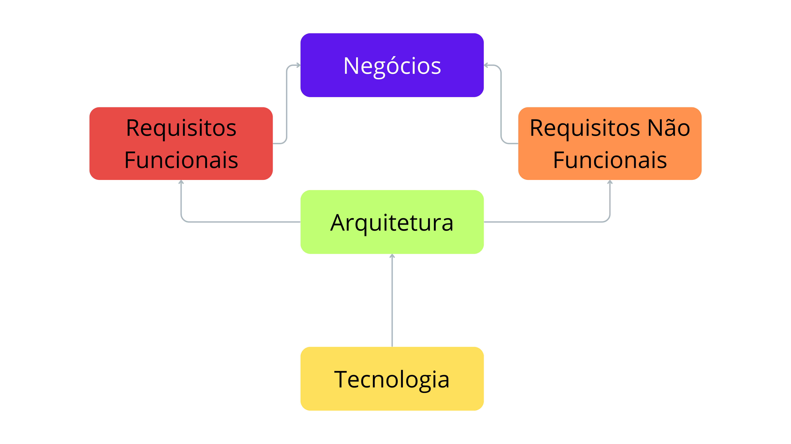 
Fonte: Material produzido pelos autores (2024)

**Visão Empresarial**:
Nesta etapa, foram definidos os objetivos principais do sistema e as diretrizes estratégicas que ele deve atender. Isso nos ajudou a garantir que o projeto estivesse alinhado às metas e necessidades do IPT.

**Visão da Informação**:
Aqui organizamos as informações e os dados que o sistema precisa manipular. O foco foi entender como esses dados seriam utilizados e garantir que fossem bem estruturados e consistentes.

**Visão Computacional**:
Nesta etapa, dividimos o sistema em partes menores, chamadas de "objetos", e definimos como eles interagem. Essa abordagem modular facilita tanto o desenvolvimento quanto futuras expansões.

**Visão de Engenharia**:
O foco foi planejar a infraestrutura necessária para que as partes do sistema pudessem se comunicar e funcionar juntas. Consideramos, por exemplo, como os componentes trocariam informações e se manteriam sincronizados.

**Visão Tecnológica**:
Por fim, escolhemos as ferramentas e tecnologias que seriam usadas para implementar o sistema. Essa etapa foi essencial para garantir que tudo funcionasse bem e de maneira segura.

&nbsp;&nbsp;&nbsp;&nbsp;O uso da metodologia foi essencial para estruturar o desenvolvimento do projeto, garantindo que cada aspecto fosse abordado de forma clara e eficiente. As visões empresariais e tecnológicas permitiram alinhar o sistema aos objetivos estratégicos e escolher tecnologias adequadas, enquanto as visões da informação, computacional e de engenharia trouxeram organização, modularidade e uma infraestrutura robusta.

# 3. Desenvolvimento e Resultados 

## 3.1. Domínio de Fundamentos de Negócio

### 3.1.1. Contexto da Indústria

&nbsp;&nbsp;&nbsp;&nbsp;O Instituto de Pesquisas Tecnológicas (IPT) é vinculado ao Governo do Estado de São Paulo que colabora para o desenvolvimento nacional na criação de soluções tecnológicas para setores da economia, governos e sociedade em apoio à superação de desafios complexos. O IPT atua principalmente em áreas como: pesquisa, desenvolvimento e inovação, serviços tecnológicos, serviços metrológicos e educação em tecnologia.

&nbsp;&nbsp;&nbsp;&nbsp;O diferencial do IPT está na sua capacidade de oferecer soluções de inovação aberta, apoiando seus clientes na criação de redes de parceiros para projetos de pesquisa, desenvolvimento e inovação (PD&I), conectando-os a instituições científicas, startups e empresas. O instituto também desenvolve tecnologias para processos e produtos, desde a escala de bancada até a escala piloto, além de oferecer suporte para a obtenção de recursos de fomento junto a agências federais e estaduais, como Finep, BNDES e FAPESP. O IPT também é credenciado pela Embrapii nos temas de Materiais Avançados e Processos Biotecnológicos. (Wikipedia, 2024)[3](#foot3).

&nbsp;&nbsp;&nbsp;&nbsp;O IPT adota uma abordagem multidisciplinar em seus serviços tecnológicos, combinando diferentes áreas de conhecimento para oferecer consultoria e avaliações técnicas com isenção e rigor. Suas atividades incluem a realização de ensaios e análises em diferentes escalas, desde microscópica até equipamentos de grande porte, desenvolvendo métodos sob medida de acordo com a demanda dos clientes. Essa flexibilidade permite ao IPT desenvolver soluções tecnológicas completas e suporte para projetos em diferentes estágios, desde a concepção até a implementação, sempre alinhado às necessidades específicas de seus parceiros e clientes.

&nbsp;&nbsp;&nbsp;&nbsp;Quanto à concorrência, destaca-se outros institutos de pesquisa, universidades, e centros de inovação que também atuam no desenvolvimento tecnológico e prestação de serviços técnicos. Entre esses concorrentes estão instituições como o Instituto Nacional de Tecnologia (INT), a Embrapa (Empresa Brasileira de Pesquisa Agropecuária), o SENAI-CIMATEC, e universidades que possuem núcleos de pesquisa tecnológica, como USP, UNICAMP, e UFRJ.

&nbsp;&nbsp;&nbsp;&nbsp;O Instituto Nacional de Tecnologia (INT), ligado ao Ministério da Ciência, Tecnologia e Inovações, atua em várias áreas industriais, oferecendo soluções tecnológicas em setores como energia, materiais e meio ambiente. Assim como o IPT, o INT oferece serviços de inovação e desenvolvimento tecnológico, além de consultorias especializadas, o que cria uma competição direta em mercados como o de inovação aberta e transferência de tecnologia. A Embrapa, com foco na pesquisa agropecuária, é uma referência em soluções tecnológicas para o agronegócio. Embora o IPT não tenha um foco na agricultura, a Embrapa compete em áreas correlatas, como biotecnologia e desenvolvimento de materiais aplicados à agricultura, criando uma sobreposição em projetos interdisciplinares que envolvem essas áreas.

&nbsp;&nbsp;&nbsp;&nbsp;O SENAI-CIMATEC é uma das principais instituições de ensino e pesquisa aplicada do país, com forte atuação em tecnologia industrial, como automação, robótica, manufatura e energias renováveis. Por ter uma relação próxima com a indústria, o SENAI-CIMATEC disputa com o IPT projetos que envolvem inovação industrial e consultoria para o setor produtivo, impactando diretamente o mercado em que o IPT opera. Universidades com núcleos de pesquisa tecnológica, como USP, UNICAMP e UFRJ, também são concorrentes relevantes, pois desenvolvem projetos de pesquisa aplicada em diversas áreas, além de terem infraestrutura de laboratórios e pesquisadores capacitados. Esses núcleos de pesquisa universitários oferecem serviços similares ao IPT, como desenvolvimento de novas tecnologias, ensaios laboratoriais e consultoria para empresas, o que pressiona a competitividade do IPT em projetos de inovação acadêmico-empresarial.

&nbsp;&nbsp;&nbsp;&nbsp;Tendo em vista isso, o mercado no qual o IPT está inserido demonstra-se extremamente concorrido e cada vez mais focado em inovação aberta, digitalização e sustentabilidade.Ao mesmo tempo, o mercado está migrando para modelos de colaboração com empresas, startups e universidades em ecossistemas de inovação cada vez mais valorizados. Para manter sua relevância, o IPT precisa se adaptar às tecnologias emergentes, como inteligência artificial, big data e internet das coisas (IoT), além de priorizar soluções voltadas para sustentabilidade e eficiência energética. Logo, investir na expansão de parcerias, no desenvolvimento de novas tecnologias e na capacitação de profissionais, para manter sua relevância e competitividade frente a instituições de peso como INT, Embrapa, SENAI-CIMATEC e as principais universidades brasileiras torna-se essencial para esse mercado.

&nbsp;&nbsp;&nbsp;&nbsp;Para melhor compreensão do contexto da indúdria foi realizada uma análise das 5 forças de Porter (Figura 2):

Figura 2 - 5 forças de porter IPT
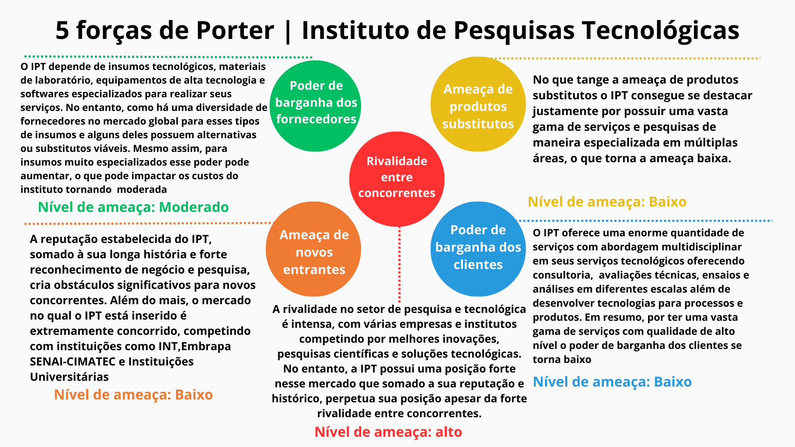
Fonte: Material produzido pelos autores (2024)

&nbsp;&nbsp;&nbsp;&nbsp;O **poder de barganha dos fornecedores** para o IPT é moderado. Embora o instituto dependa de insumos tecnológicos, equipamentos de alta tecnologia e softwares especializados, há uma diversidade de fornecedores no mercado que pode atender a essas necessidades, possibilitando a negociação de melhores preços e condições. No entanto, para itens altamente especializados e de difícil substituição, como certos equipamentos científicos e insumos de laboratório específicos, o poder de barganha dos fornecedores aumenta, impactando diretamente os custos e a flexibilidade do IPT. Portanto, o impacto dessa força é moderado, pois a variedade de opções reduz o poder dos fornecedores, mas a dependência de itens especializados o aumenta.

&nbsp;&nbsp;&nbsp;&nbsp;Em relação à **ameaça de produtos substitutos**, o IPT se encontra em uma posição segura. A variedade de serviços oferecidos, que abrange diversas áreas tecnológicas e científicas, torna difícil a substituição por produtos ou serviços equivalentes. A especialização e a capacidade de adaptação às demandas específicas de cada projeto diminuem significativamente essa ameaça, pois poucos concorrentes conseguem igualar o conhecimento técnico e a qualidade dos serviços fornecidos pelo IPT. Assim, a ameaça de substitutos é considerada baixa, já que a instituição oferece serviços difíceis de replicar no mercado que está inserido.

&nbsp;&nbsp;&nbsp;&nbsp;A **ameaça de novos entrantes** no mercado de pesquisa tecnológica é baixa para o IPT. A reputação consolidada ao longo de sua história, somada à confiança dos clientes na qualidade dos serviços prestados, cria barreiras significativas para novos competidores. Além disso, os altos custos de entrada no mercado, que exigem infraestrutura avançada, laboratórios especializados e capacidade técnica, tornam a competição direta ainda mais difícil para novos entrantes. Assim, embora o mercado seja altamente concorrido, com instituições como o INT, Embrapa, SENAI-CIMATEC e universidades estabelecidas, a entrada de novos players é pouco provável.

&nbsp;&nbsp;&nbsp;&nbsp;A **rivalidade entre os concorrentes** no setor de pesquisa e inovação tecnológica é alta. O IPT enfrenta forte competição de outras grandes instituições de pesquisa, como o INT, Embrapa e centros universitários. Todas essas instituições competem por financiamento, projetos de pesquisa e parcerias com o setor privado. No entanto, a reputação do IPT, aliado ao seu longo histórico, suas especialidades multidisciplinares e sua flexibilidade no atendimento das demandas dos clientes ajudam a manter sua posição e competitividade. Ainda assim, a rivalidade constante pressiona o IPT a continuar inovando e mantendo altos padrões de qualidade para se destacar no mercado.

&nbsp;&nbsp;&nbsp;&nbsp;O **poder de barganha dos clientes** no caso do IPT é baixo. O instituto oferece uma ampla variedade de serviços especializados e personalizados para atender às necessidades de cada cliente, desde consultorias técnicas até o desenvolvimento de produtos em diversas escalas. A abordagem multidisciplinar do IPT, combinada com sua capacidade de realizar análises complexas, cria uma dependência dos clientes em relação aos serviços prestados. Além disso, o reconhecimento da qualidade e confiabilidade dos resultados do IPT faz com que os clientes tenham poucas opções alternativas com o mesmo nível de qualidade, reduzindo o poder de barganha dos clientes.

&nbsp;&nbsp;&nbsp;&nbsp;Em conclusão, o IPT atua em um mercado caracterizado por uma alta rivalidade, porém com baixa ameaça de substitutos, baixa possibilidade de novos entrantes e pouco poder de barganha dos clientes, o que fortalece sua posição competitiva. No entanto, o poder moderado dos fornecedores junto a essa alta rivalidade no mercado exige que o IPT continue investindo em inovação e na manutenção de sua infraestrutura tecnológica para sustentar sua vantagem competitiva. Essas forças combinadas indicam que o IPT está bem posicionado no mercado, mas deve continuar atento às mudanças externas.

### 3.1.2. Análise SWOT
&nbsp;&nbsp;&nbsp;&nbsp;A matriz SWOT é uma ferramenta de análise de mercado utilizada para identificar e analisar as forças (Strengths), fraquezas (Weaknesses), oportunidades (Opportunities) e ameaças (Threats) de uma empresa ou projeto. O objetivo dessa análise é oferecer uma visão clara e abrangente das condições internas e externas que podem impactar no desenvolvimento de um projeto e no desempenho da empresa. Com isso a matriz ajuda na formulação de estratégias eficientes para alcançar os objetivos empresariais (Alicia Raeburn, 2024)[6](#foot6). (Figura 3).

Figura 3 - Matriz Swot 
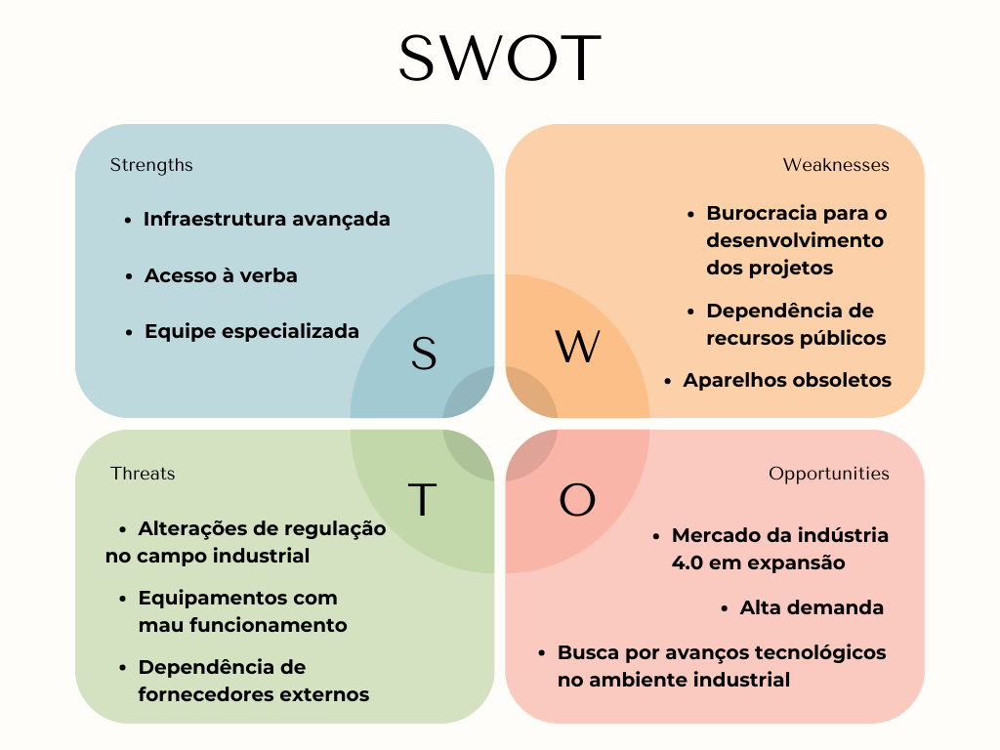 
Fonte: Material produzido pelos autores (2024)

#### Forças (Strengths)

1. **Infraestrutura Avançada**
   - O IPT conta com uma infraestrutura de ponta, com laboratórios que possuem equipamentos altamente tecnológicos para realizar pesquisas, ensaios, análises e testes. Essa infraestrutura é um dos maiores ativos da instituição, pois permite que o instituto garanta precisão e confiabilidade em seus serviços.
   
2. **Acesso à Verba**
   - O IPT, por ser uma instituição pública, possui acesso à verbas governamentais que possibilitam o financiamento de grandes projetos. Além disso, as parcerias com o setor privado também ampliam o fluxo de recursos financeiros para inovação.

3. **Equipe Especializada**
   - Com uma equipe de grande diversidade acadêmica composta por especialistas em diferentes áreas tecnológicas, o IPT se destaca pela capacidade técnica e experiência em solucionar desafios complexos, desde problemas industriais até pesquisas de alto impacto.

#### Fraquezas (Weaknesses)

1. **Burocracia para o Desenvolvimento dos Projetos**
   - Como uma instituição pública, o IPT enfrenta desafios relacionados à burocracia, o que pode acabar atrasando processos e aumentando o tempo necessário para iniciar, desenvolver e finalizar projetos.

2. **Dependência de Recursos Públicos**
   - Embora o IPT possua acesso a verbas, a dependência intrínseca de recursos públicos pode representar um problema, especialmente em momentos de instabilidade econômica e política no país, que podem acarretar em cortes de financiamento de verbas para ciência e tecnologia.

3. **Equipamentos com Mau Funcionamento e Aparelhos Obsoletos**
   - Alguns dos equipamentos utilizados no IPT podem ser obsoletos e exigem manutenções mais frequentemente. A falta de atualização constante pode prejudicar a competitividade da instituição no mercado brasileiro de pesquisas, principalmente porque labotatórios de pesquisa privados sofrem menos com equipamentos datatos e obsoletos e estão em constante atualização em seus equipamentos.

#### Oportunidades (Opportunities)

1. **Mercado da Indústria 4.0 em Expansão**
   - Com o avanço da indústria 4.0 e o crescimento de novas tecnologias emergentes, como IoT e inteligência artificial, o IPT tem uma oportunidade única de expandir sua atuação e se posicionar como um dos líderes na implementação dessas tecnologias em alto nível no Brasil.

2. **Alta Demanda**
   - A crescente demanda por soluções tecnológicas avançadas e sustentáveis no setor industrial proporciona ao IPT uma grande oportunidade de se consolidar como referência na criação de soluções inovadoras.

3. **Busca por Avanços Tecnológicos no Ambiente Industrial**
   - Empresas buscam cada vez mais otimizar seus processos e reduzir custos por meio das inovações tecnológicas. O IPT está no centro desse mercado e está preparado para atender a essa crescente demanda, ainda mais com projetos voltados para a sustentabilidade, eficiência energética e minimização de custos.

#### Ameaças (Threats)

1. **Alterações de Regulação no Campo Industrial**  
   - Mudanças em regulamentações governamentais e normativas industriais podem acontecer, e afetam a maneira como o IPT opera e financia seus projetos. A necessidade de se adequar constantemente às novas regras pode gerar custos adicionais e não previstos no orçamento inicial de investimento financeiro e de tempo.

2. **Dependência de Fornecedores Externos**  
   - A necessidade de contar com fornecedores externos para insumos e componentes essenciais pode comprometer a continuidade dos projetos, especialmente em períodos de crise nas cadeias de suprimentos globais. A dependência de parceiros externos torna o IPT vulnerável a oscilações de mercado e limita sua capacidade de resposta rápida a demandas emergentes.

3. **Escassez de Mão de Obra Qualificada**  
   - Com o avanço das tecnologias e o aumento da complexidade dos projetos, a disponibilidade de profissionais qualificados se torna cada vez mais limitada. A dificuldade em atrair e reter talentos pode impactar negativamente o desempenho dos projetos, colocando o IPT em uma posição de vulnerabilidade frente à alta demanda por especialistas no mercado.

### 3.1.3. Descrição da Solução a ser Desenvolvida

&nbsp;&nbsp;&nbsp;&nbsp;Esta seção visa discorrer sobre diferentes aspectos referentes à solução a ser desenvolvida — um dispositivo IoT (_Internet of Things_) para monitoramentos de máquinas do Instituto de Pesquisas Tecnológicas — como a justificativa, ou seja, o problema a ser resolvido, o modo de utilização, os benefícios trazidos por ela, além do critério de sucesso aplicado.

#### 3.1.3.1 Qual é o problema a ser resolvido
&nbsp;&nbsp;&nbsp;&nbsp;O problema identificado é a falta de um sistema automatizado para o monitoramento contínuo dos equipamentos no laboratório de processos metalúrgicos. Essa ausência resulta em altos custos operacionais, desgaste prematuro dos equipamentos e frequentes interrupções no funcionamento, devido à supervisão inadequada das condições operacionais.

#### 3.1.3.2 Qual a solução proposta (visão de negócios)
&nbsp;&nbsp;&nbsp;&nbsp;A solução proposta envolve o desenvolvimento de um dispositivo de baixo custo, capaz de monitorar de forma automatizada as condições operacionais dos equipamentos (prensa e compressor), independentemente de estarem em uso. Este sistema visa monitorar variáveis críticas, como temperatura, vibração e tempo de uso, permitindo a detecção de falhas ou a necessidade de manutenção preventiva, antes que os problemas causem falhas maiores ou paradas inesperadas.

#### 3.1.3.3 Como a solução proposta deverá ser utilizada
&nbsp;&nbsp;&nbsp;&nbsp;A solução será implementada como um sistema de monitoramento integrado aos equipamentos,a partir de um dispositivo IoT, funcionando de maneira contínua e coletando dados em tempo real, como a medição do tempo de uso de cada máquina e do tempo entre as  trocas de óleo. Também serão usados sensores de monitoramento de temperatura, vibração(acelerômetro) e movimentação(sensor Ultrasônico)  para registar e enviar as informações para uma central de controle, onde alertas e relatórios de manutenção serão gerados automaticamente. O sistema deverá ser instalado pelos próprios engenheiros do IPT e  ser de fácil integração com os sistemas já existentes, com uma interface amigável para o acompanhamento pelos técnicos e engenheiros.

#### 3.1.3.4 Quais os benefícios trazidos pela solução proposta
&nbsp;&nbsp;&nbsp;&nbsp;Os benefícios esperados da solução proposta são diversos. Em primeiro lugar, haverá uma significativa redução dos custos operacionais, já que o monitoramento automatizado permitirá a realização de manutenções preventivas, evitando falhas inesperadas e, consequentemente, prolongando a vida útil dos equipamentos. Além disso, a eficiência operacional será aumentada, pois o monitoramento contínuo garantirá maior disponibilidade dos equipamentos, reduzindo o tempo de inatividade. Outro benefício importante é a melhoria na tomada de decisões, que será baseada em dados coletados em tempo real sobre o estado dos equipamentos, o que possibilitará uma gestão mais eficaz dos recursos. Por fim, a solução também contribuirá para aumentar a segurança no ambiente de trabalho, ao detectar falhas antecipadamente, prevenindo acidentes e garantindo a segurança dos operadores.

#### 3.1.3.5 Qual será o critério de sucesso e qual medida será utilizada para o avaliar
&nbsp;&nbsp;&nbsp;&nbsp;O sucesso do projeto será alcançado se a solução proposta monitorar continuamente os equipamentos do laboratório de processos metalúrgicos, resolvendo eficazmente problemas de manutenção e disponibilidade. Para medir esse sucesso, serão utilizados indicadores como MTBF (_Mean Time Between Failures_ - Tempo Médio Entre Falhas) e MTTR (_Mean Time To Repair_ - Tempo Médio de Reparação). O MTBF indica o tempo médio entre duas falhas consecutivas, e seu aumento refletirá maior confiabilidade e menos interrupções dos equipamentos. Já o MTTR representa o tempo médio para reparar um equipamento após uma falha, e sua redução demonstrará maior eficiência na manutenção, minimizando o tempo de inatividade.

&nbsp;&nbsp;&nbsp;&nbsp;Além desses, outros indicadores de sucesso incluem a satisfação dos operadores e técnicos, a redução de falhas e interrupções frequentes, a melhoria da eficiência operacional com maior disponibilidade dos equipamentos, o prolongamento da vida útil dos equipamentos por meio de manutenção preventiva e o aumento da segurança no ambiente de trabalho ao detectar falhas antecipadamente. A implementação bem-sucedida será confirmada pela capacidade da solução em prevenir erros, aumentar a eficiência e garantir a disponibilidade contínua dos equipamentos para os projetos e ensaios no laboratório. As métricas MTBF e MTTR serão essenciais para quantificar esses benefícios e monitorar o desempenho do sistema de monitoramento ao longo do tempo.

### 3.1.4. Value Proposition Canvas

&nbsp;&nbsp;&nbsp;&nbsp;O Value Proposition Canvas é uma ferramenta visual utilizada para ajudar a desenvolver e alinhar a proposta de valor de um produto ou serviço às necessidades dos clientes. Ele é dividido em duas áreas principais: o Perfil do Cliente e o Mapa de Valor. (Amanda Rushiken, 2023)[8](#foot8).

&nbsp;&nbsp;&nbsp;&nbsp;No Perfil do Cliente, são analisadas as tarefas que o cliente precisa realizar (jobs), os problemas ou desafios que ele enfrenta (pains) e os benefícios ou resultados que ele deseja alcançar (gains). Isso ajuda a entender com maior profundidade o que realmente importa para o cliente e quais são suas principais preocupações e desejos.

&nbsp;&nbsp;&nbsp;&nbsp;Já o Mapa de Valor descreve como o produto ou serviço(Products & services) atende a essas necessidades. Aqui são detalhados os produtos e serviços oferecidos, como eles ajudam a resolver os problemas do cliente (Pain relievers) e como eles criam valor adicional, gerando benefícios que o cliente valoriza (Gain creators).

&nbsp;&nbsp;&nbsp;&nbsp;O objetivo do Value Proposition Canvas é garantir que a solução desenvolvida esteja diretamente conectada às dores e necessidades do cliente, oferecendo um valor claro e relevante. Ele ajuda a identificar se a proposta de valor realmente faz sentido para o cliente, focado em entregar uma solução que resolva seus problemas e maximize os benefícios desejados. (Figura 4).

Figura 4 - Value Proposition Canvas 
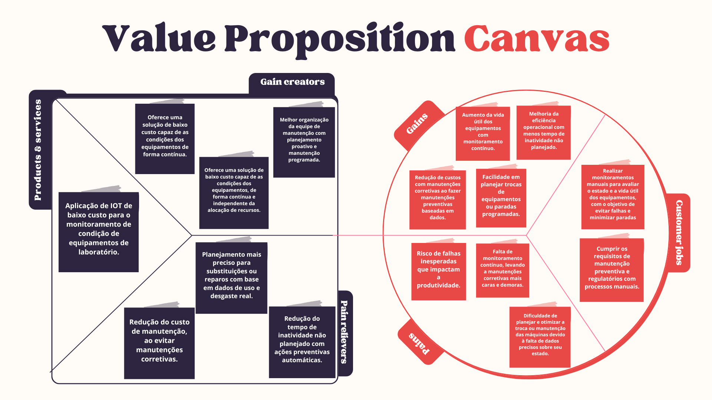 
Fonte: Material produzido pelos autores (2024)

#### 1. Customer Profile(Perfil do usuário)
##### Pains(Dores)
1.  Dificuldade de planejar trocas ou manutenção por falta de dados
Sem monitoramento contínuo, a equipe de manutenção depende de ciclos predefinidos ou de diagnósticos manuais, o que muitas vezes resulta em manutenções mal planejadas ou desnecessárias. A solução IoT resolve esse problema fornecendo dados em tempo real, possibilitando decisões baseadas em evidências, o que resulta em planejamento otimizado e maior eficiência operacional.
2.  Falta de monitoramento contínuo, levando a manutenções corretivas mais caras e demoradas
Sem um sistema de monitoramento contínuo, a equipe de manutenção muitas vezes só percebe problemas quando o equipamento já está danificado ou funcionando abaixo do ideal. Isso resulta em manutenções corretivas, que são mais caras e demoradas do que as manutenções preventivas. Além disso, a interrupção causada pela falha do equipamento pode impactar diretamente as operações laboratoriais, gerando atrasos nas pesquisas e aumento de custos operacionais. A ausência de dados em tempo real também dificulta o planejamento adequado das intervenções, aumentando o risco de tempos de inatividade longos e não programados.

3. Risco de falhas inesperadas que impactam a produtividade
O risco de falhas inesperadas em equipamentos é elevado quando não há um sistema de monitoramento eficiente. Equipamentos críticos podem falhar subitamente, paralisando processos de laboratório e comprometendo prazos de projetos importantes. Além do impacto direto na produtividade, as falhas inesperadas podem gerar custos significativos, tanto pela substituição de componentes quanto pelo tempo ocioso causado pela interrupção das atividades. Sem monitoramento, essas falhas não são previstas e corrigidas a tempo, gerando uma cadeia de problemas que poderia ser evitada com uma solução de IoT que acompanhe continuamente as condições dos equipamentos.
##### Gains(ganhos)
1. Redução dos custos de manutenção, evitando manutenções corretivas
A solução permite que a maioria das falhas seja prevista com antecedência, o que reduz a necessidade de reparos de emergência, normalmente mais caros e que causam longos períodos de inatividade. Manutenções preventivas são agendadas com base no estado real do equipamento, otimizando o ciclo de manutenção e evitando gastos desnecessários com consertos urgentes.
2. Redução do tempo de inatividade não planejado com ações preventivas automáticas
Com o monitoramento contínuo e a geração de alertas automáticos, o sistema detecta problemas potenciais antes que se tornem críticos. A partir daí, ações preventivas são recomendadas e podem ser agendadas para momentos em que o impacto sobre a operação seja mínimo. Isso resulta em uma diminuição significativa do tempo de inatividade não planejado, garantindo maior disponibilidade dos equipamentos.
3. Aumento da vida útil dos equipamentos com monitoramento contínuo
Ao monitorar constantemente o estado dos equipamentos, o sistema de IoT ajuda a prolongar a vida útil das máquinas, uma vez que falhas catastróficas são evitadas, e o uso inadequado é corrigido rapidamente. Intervenções preventivas ajudam a manter as máquinas em condições ideais de funcionamento, evitando que pequenos problemas se agravem.
4. Melhoria da eficiência operacional com menos tempo de inatividade não planejado
A redução de paradas inesperadas significa que os processos laboratoriais podem continuar sem interrupções, melhorando a eficiência geral das operações. Isso é especialmente importante em ambientes de laboratório, onde o tempo de inatividade pode prejudicar a continuidade das pesquisas e gerar atrasos nos resultados.

##### Customer Jobs(Tarefas do cliente)

1. Realizar monitoramentos manuais para avaliar o estado e a vida útil dos equipamentos, com o objetivo de evitar falhas e minimizar paradas. Sem a tecnologia de IoT, a equipe de manutenção precisa fazer inspeções manuais periódicas e depender de ciclos predefinidos para programar intervenções. Esse processo é mais lento e muitas vezes resulta em paradas inesperadas devido a falhas não detectadas a tempo.

2. Cumprir os requisitos de manutenção preventiva e regulatórios com processos manuais. Muitos laboratórios têm obrigações de manter registros atualizados de manutenção para atender a normas regulatórias. Sem uma solução automatizada, esses registros e o cumprimento de normas dependem de relatórios manuais e inspeções, o que consome tempo e pode deixar lacunas nas manutenções programadas.

#### 2. Value Map (Mapa de Valor):
##### Pain relievers(Aliviadores de Dores)
1.  Planejamento preciso para substituições ou reparos com base em dados reais
O sistema de monitoramento IoT coleta dados detalhados sobre o uso e o desgaste de cada equipamento. Isso possibilita previsões exatas sobre a vida útil restante das máquinas, permitindo que os gestores planejem substituições ou reparos com base em informações confiáveis. Dessa forma, evita-se tanto a substituição prematura de equipamentos que ainda têm vida útil quanto a manutenção atrasada de equipamentos que estão perto do fim de sua capacidade operacional.
2. Redução dos custos de manutenção, evitando manutenções corretivas
A solução permite que a maioria das falhas seja prevista com antecedência, o que reduz a necessidade de reparos de emergência, normalmente mais caros e que causam longos períodos de inatividade. Manutenções preventivas são agendadas com base no estado real do equipamento, otimizando o ciclo de manutenção e evitando gastos desnecessários com consertos urgentes.
3. Redução do tempo de inatividade não planejado com ações preventivas automáticas
Com o monitoramento contínuo e a geração de alertas automáticos, o sistema detecta problemas potenciais antes que se tornem críticos. A partir daí, ações preventivas são recomendadas e podem ser agendadas para momentos em que o impacto sobre a operação seja mínimo. Isso resulta em uma diminuição significativa do tempo de inatividade não planejado, garantindo maior disponibilidade dos equipamentos.
##### Products & Services(Aliviadores de Dores)
1. Aplicação de IOT para o monitoramento de condição de equipamentos de laboratório.
A aplicação de IoT (Internet of Things) para o monitoramento de condição de equipamentos de laboratório envolve o uso de sensores conectados a uma rede que coleta, processa e transmite dados em tempo real sobre o estado dos equipamentos. Esses sensores podem monitorar diversas condições, como temperatura, vibração, tempo de uso e outros parâmetros críticos que indicam o desempenho e a saúde das máquinas.
Com o monitoramento contínuo, é possível prever falhas, realizar manutenções preventivas e otimizar o tempo de vida útil dos equipamentos. A IoT permite que os gestores de laboratório acompanhem remotamente as condições dos dispositivos, recebam alertas automáticos quando algum parâmetro estiver fora do padrão e gerem relatórios detalhados para melhorar o planejamento da manutenção. Isso resulta em menor tempo de inatividade, redução de custos operacionais e maior eficiência nos processos laboratoriais.
##### Gains Creator(Criadores de ganho)
1. Solução de baixo custo para monitoramento contínuo e independente
A solução de IoT oferecida é projetada para ser acessível, proporcionando monitoramento contínuo das condições dos equipamentos, sem a necessidade de alocação constante de recursos humanos. Sensores de baixo custo conectados a uma plataforma central monitoram parâmetros críticos (como temperatura, vibração e horas de operação) 24 horas por dia, 7 dias por semana. Isso elimina a necessidade de inspeções manuais frequentes, permitindo um sistema autônomo que coleta e transmite dados em tempo real.
2. Melhor organização da equipe de manutenção com planejamento proativo
Com a integração de IoT, os dados dos equipamentos são analisados e disponibilizados para a equipe de manutenção, permitindo um planejamento mais eficiente. Ao invés de manutenções corretivas que interrompem o funcionamento inesperadamente, as intervenções são agendadas de forma proativa, quando necessário, com base no desgaste real dos componentes. Isso otimiza o uso dos técnicos, evitando sobrecarga e reduzindo o tempo ocioso causado por falhas não previstas.
3. Planejamento preciso para substituições ou reparos com base em dados reais
O sistema de monitoramento IoT coleta dados detalhados sobre o uso e o desgaste de cada equipamento. Isso possibilita previsões exatas sobre a vida útil restante das máquinas, permitindo que os gestores planejem substituições ou reparos com base em informações confiáveis. Dessa forma, evita-se tanto a substituição prematura de equipamentos que ainda têm vida útil quanto a manutenção atrasada de equipamentos que estão perto do fim de sua capacidade operacional.
#### Conclusão
&nbsp;&nbsp;&nbsp;&nbsp;Em conclusão, a aplicação do Value Proposition Canvas ao contexto de monitoramento de equipamentos laboratoriais por meio de IoT é fundamental para alinhar a proposta de valor às reais necessidades do cliente. Ao identificar as dores e desafios, como a falta de monitoramento contínuo e o risco de falhas inesperadas, o Canvas permite o desenvolvimento de uma solução que não só alivia esses problemas, mas também cria valor tangível para o cliente, como a redução de custos operacionais, aumento da eficiência e prolongamento da vida útil dos equipamentos. A implementação de uma solução IoT acessível e autônoma, que oferece monitoramento contínuo e facilita o planejamento proativo da manutenção, transforma a maneira como os laboratórios gerenciam seus ativos, garantindo maior produtividade e eficiência.
    

### 3.1.5. Matriz de Riscos

&nbsp;&nbsp;&nbsp;&nbsp;A Matriz de Risco é uma ferramenta utilizada para analisar e avaliar os potenciais riscos de um projeto. Esses riscos são organizados e classificados em uma matriz que analisa a probabilidade de ocorrência do risco e o impacto caso ele se concretize. Com isso, é possível realizar a análise de quais riscos devem ser priorizados, a partir do encontro entre a probabilidade e o impacto, permitindo assim uma melhor gestão do projeto. (Napoleão, 2019)[1](#foot1).

&nbsp;&nbsp;&nbsp;&nbsp;Agora a Matriz de Oportunidades é uma ferramenta utilizada para identificar e avaliar as potenciais oportunidades de um projeto ou iniciativa. Essas oportunidades são organizadas e classificadas em uma matriz que considera a probabilidade de sua ocorrência e o impacto positivo que podem gerar, caso sejam aproveitadas, permitindo a visualização clara de quais delas têm o maior potencial de benefício para o projeto. A matriz auxilia na priorização das oportunidades que devem ser exploradas, contribuindo para uma gestão mais proativa e estratégica do projeto. (Roberta de Lucca, 2024)[7](#foot7). (Figura 5 e 6)

#### Matriz de Riscos

Figura 5 - Matriz de Riscos  
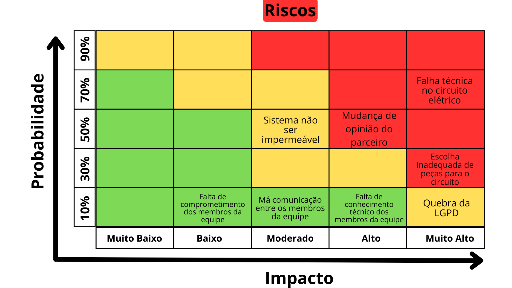 
Fonte: Os autores (2024)

&nbsp;&nbsp;&nbsp;&nbsp;Prioridades dos Riscos:
 - Baixa Prioridade:
    1. Falta de comprometimento dos membros da equipe
        - Impacto: O risco impactaria no projeto como um todo, pois diversos problemas podem ocorrer decorrentes desse risco, como deixar de fazer alguma tarefa ou até mesmo fazer de uma forma incorreta.
        - Plano de Resposta ao Risco: Mitigar, reduzir a probabilidade e/ou o impacto da ameaça.
    2. Má comunicação entre os membros da equipe
        - Impacto: Quando há uma falta de comunicação, há também uma maior probabilidade de mal-entendidos e falta de alinhamento entre as tarefas, resultando em uma entrega ineficaz ou incorreta.
        - Plano de Resposta ao Risco: Mitigar, reduzir a probabilidade e/ou o impacto da ameaça.
    3. Falta de conhecimento técnico dos membros da equipe
        - Impacto: O risco impactaria no projeto como um todo, pois como não há conhecimento técnico se torna impossível realizar o projeto.
        - Plano de Resposta ao Risco: Mitigar, reduzir a probabilidade e/ou o impacto da ameaça.

 - Média Prioridade:
    1. Sistema não ser impermeável
        - Impacto: O risco teria impacto direto no MVP do projeto, pois a impermeabilidade é uma das exigências do parceiro.
        - Plano de Resposta ao Risco: Mitigar, reduzir a probabilidade e/ou o impacto da ameaça.
    2. Quebra da LGPD
        - Impacto: O risco teria impacto severo tanto na imagem do grupo quanto na do Inteli, além de resultar em possíveis sanções legais.
        - Plano de Resposta ao Risco: Mitigar, reduzir a probabilidade e/ou o impacto da ameaça.
 - Alta Prioridade:
    1. Falha técnica no circuiro elétrico
        - Impacto: O risco teria impacto no projeto como um todo, pois impediria o andamento do projeto inteiro.
        - Plano de Resposta ao Risco: Mitigar, reduzir a probabilidade e/ou o impacto da ameaça.
    2. Mudança de opinião do parceiro
        - Impacto: O risco teria impacto no projeto afetando o escopo e o cronograma. Essas alterações podem exigir revisões no projeto, mudanças nas funcionalidades já desenvolvidas, ou até mesmo a redefinição completa de certas partes do projeto.
        - Plano de Resposta ao Risco: Mitigar, reduzir a probabilidade e/ou o impacto da ameaça.
    3. Escolha inadequada de peças para o circuito
        - Impacto: O risco teria impacto no projeto como um todo, pois afetaria a qualidade da entrega, assim causando também uma insatisfação no parceiro.
        - Plano de Resposta ao Risco: Mitigar, reduzir a probabilidade e/ou o impacto da ameaça.
 
 

Figura 6 - Matriz de Oportunidades  
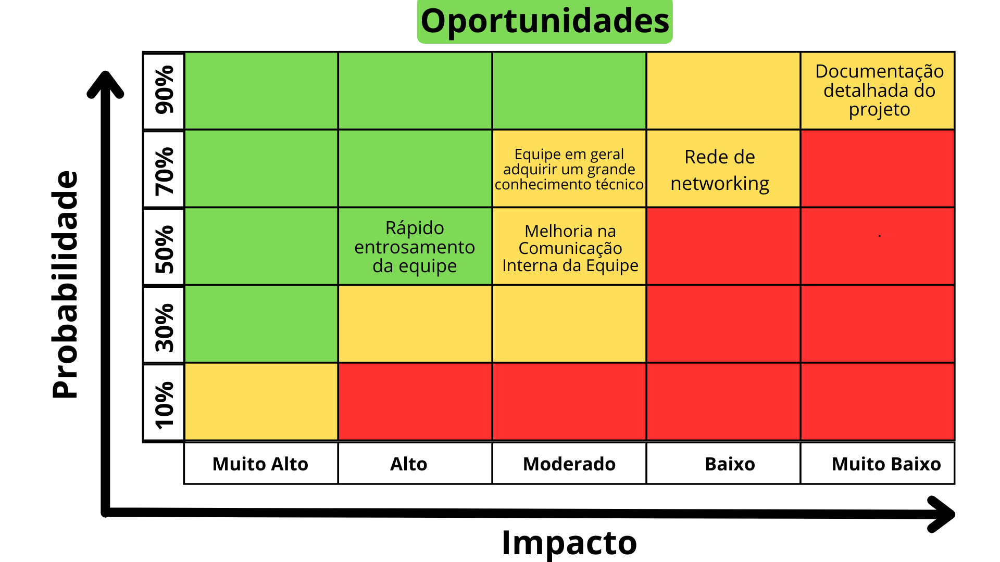 
Fonte: Os autores (2024)

&nbsp;&nbsp;&nbsp;&nbsp;Prioridades das Oportunidades:
 - Média Prioridade:
    1. Documentação detalhada do projeto
        - Impacto: Facilita a manutenção ou a implementação de *features* no futuro do projeto.
        - Plano de Resposta à Oportunidade: Aumentar, aumentar a probabilidade e/ou o impacto da oportunidade.
    2. Rede de Networking
        - Impacto: Com um networking bem-sucedido pode abrir portas para futuras colaborações, proporcionar acesso a novas oportunidades de carreira, e fortalecer a reputação dos profissionais e da organização.
        - Plano de Resposta à Oportunidade: Aumentar, aumentar a probabilidade e/ou o impacto da oportunidade.
    3. Equipe em geral adquirir um grande conhecimento técnico
        - Impacto: Um aumento na competência técnica permitiria à equipe enfrentar desafios complexos com maior eficiência, resultando em soluções mais inovadoras e eficazes.
        - Plano de Resposta à Oportunidade: Aumentar, aumentar a probabilidade e/ou o impacto da oportunidade.
    4. Melhoria na comunicação interna de equipe
        - Impacto: Com uma comunicação interna boa e efetiva, acaba reduzindo mal-entendidos e também aumentando a eficiência da equipe.
        - Plano de Resposta à Oportunidade: Aumentar, aumentar a probabilidade e/ou o impacto da oportunidade.
    5. Rápido entrosamento da equipe
        - Impacto: Com uma equipe bem entrosada, a comunicação flui melhor, as tarefas são realizadas de forma mais coordenada, o que contribui para a produção de resultados de maior qualidade no projeto.
        - Plano de Resposta à Oportunidade: Aumentar, aumentar a probabilidade e/ou o impacto da oportunidade.

&nbsp;&nbsp;&nbsp;&nbsp;Por fim, a análise completa dos possíveis riscos que podem influenciar o desenvolvimento da solução IoT é facilitada pela Matriz de Riscos. Ao identificar os riscos com base em seu impacto e probabilidade de ocorrência, é possível estabelecer uma ordem de prioridades para as ameaças. Além disso, a Matriz de Riscos também permite identificar e explorar oportunidades que podem potencialmente beneficiar o projeto. Assim, além de prever ameaças, a matriz também serve como um guia para aproveitar ao máximo as condições favoráveis, contribuindo para o alcance dos objetivos e o sucesso do projeto.

### 3.1.6. Política de Privacidade de acordo com a LGPD  

&nbsp;&nbsp;&nbsp;&nbsp;A Política de Privacidade é um documento essencial no contexto de colaboração entre o IPTecos — o Grupo 03 do 4º módulo de 2024 da Turma 12 de alunos do Inteli — e o Instituto de Pesquisas Tecnológicas (IPT), dada a necessidade de coleta e análise de dados. Esse documento assegura aos usuários, colaboradores e parceiros, enquanto titulares dos dados, que seus dados pessoais estão sendo tratados com respeito e de acordo com a Lei Geral de Proteção de Dados (LGPD). (Kore, 2024)[5](#foot5)

#### 3.1.6.1 Informações gerais sobre a empresa / organização  

&nbsp;&nbsp;&nbsp;&nbsp;O Instituto de Tecnologia e Liderança (Inteli), pessoa jurídica de direito privado, está localizado na Av. Prof. Almeida Prado, 520 - Butantã, São Paulo - SP, 05508-070, e inscrito no CNPJ/MF sob o nº 28.226.170/0001-08.  
&nbsp;&nbsp;&nbsp;&nbsp;Em parceria com o Instituto de Pesquisas Tecnológicas (IPT), o Inteli reforça seu compromisso com a proteção de dados pessoais. A colaboração com o time IPTecos no projeto de monitoramento e análise utiliza a plataforma Ubidots para coletar e tratar dados de forma responsável, garantindo total conformidade com a legislação vigente.  

#### 3.1.6.2 Informações sobre o tratamento de dados  

&nbsp;&nbsp;&nbsp;&nbsp;O tratamento de dados coletados pela Ubidots tem como principal objetivo proporcionar funcionalidades avançadas no monitoramento e análise, garantindo a segurança da plataforma e a personalização de serviços. Esses dados são tratados de acordo com os seguintes princípios:  
- **Finalidade**: O tratamento dos dados tem propósitos claros e legítimos, como melhoria da experiência do usuário, monitoramento de dispositivos conectados e otimização de processos.  
- **Adequação**: Os dados tratados estão alinhados às necessidades do projeto.  
- **Segurança**: Todas as medidas de proteção de dados são aplicadas para mitigar riscos de vazamentos ou acessos indevidos.  

#### 3.1.6.3 Quais são os dados coletados  

&nbsp;&nbsp;&nbsp;&nbsp;Os dados coletados incluem informações fornecidas diretamente pelos usuários, como nome e e-mail, e informações técnicas geradas durante a interação com a plataforma, como endereço IP, localização aproximada, tipo de dispositivo e logs de sistema.  
&nbsp;&nbsp;&nbsp;&nbsp;Além disso, a plataforma Ubidots registra dados provenientes de dispositivos IoT, como temperatura, pressão e vibração, para análise em tempo real e aplicação em estudos avançados de engenharia.  

#### 3.1.6.4 Onde os dados são coletados  

&nbsp;&nbsp;&nbsp;&nbsp;Os dados são coletados por meio da integração com a plataforma Ubidots. Esta plataforma atua como um ponto central de coleta, unificando dados provenientes de dispositivos IoT conectados e informações inseridas diretamente pelos usuários.  

#### 3.1.6.5 Para quais finalidades os dados serão utilizados  

&nbsp;&nbsp;&nbsp;&nbsp;Os dados coletados têm múltiplas finalidades, incluindo:  
1. **Monitoramento e análise**: Auxiliar no acompanhamento em tempo real das condições ambientais ou operacionais registradas pelos dispositivos IoT.  
2. **Melhoria da experiência do usuário**: Personalizar a interação com a plataforma e apresentar insights mais relevantes.  
3. **Segurança e auditoria**: Proteger a integridade dos dados e garantir o cumprimento das obrigações legais.  

#### 3.1.6.6 Onde os dados ficam armazenados  

&nbsp;&nbsp;&nbsp;&nbsp;Os dados são armazenados nos servidores na nuvem da Ubidots, localizados em provedores de alta confiabilidade, como IBM Cloud. Estes servidores seguem rigorosos padrões internacionais de segurança, com auditorias regulares para proteger as informações contra ataques cibernéticos e acessos não autorizados.  

#### 3.1.6.7 Qual o período de armazenamento dos dados (retenção)  

&nbsp;&nbsp;&nbsp;&nbsp;O período padrão de retenção dos dados é de três meses, a menos que haja uma necessidade específica do projeto ou exigências regulatórias. Caso o período seja alterado, os titulares dos dados serão notificados com antecedência.  

#### 3.1.6.8 Uso de *cookies* e/ou tecnologias semelhantes  

&nbsp;&nbsp;&nbsp;&nbsp;A Ubidots utiliza *cookies* para gerenciar sessões, armazenar preferências e otimizar o desempenho da plataforma. Os *cookies* são necessários para o funcionamento eficiente da interface e podem ser gerenciados ou desativados pelos usuários através das configurações de seus navegadores.  

#### 3.1.6.9 Com quem esses dados são compartilhados (parceiros, fornecedores, subcontratados)  

&nbsp;&nbsp;&nbsp;&nbsp;Os dados são compartilhados com o IPT, além de parceiros essenciais, como a própria Ubidots e provedores de serviços de nuvem. Todos os parceiros seguem os padrões de privacidade e segurança estipulados pela LGPD.  

#### 3.1.6.10 Informações sobre medidas de segurança adotadas pela empresa  

&nbsp;&nbsp;&nbsp;&nbsp;São implementadas medidas avançadas para proteger os dados, incluindo:  
- Criptografia de ponta a ponta na transmissão de informações.  
- Controle rigoroso de acesso aos dados.  
- Monitoramento contínuo de vulnerabilidades e incidentes de segurança.  

#### 3.1.6.11 Orientações sobre como a empresa/organização atende aos direitos dos usuários  

&nbsp;&nbsp;&nbsp;&nbsp;Os usuários podem exercer seus direitos, como acesso, retificação e exclusão de dados, entrando em contato pelo e-mail [parcerias@inteli.edu.br](mailto:parcerias@inteli.edu.br). O time IPTecos assegura que todas as solicitações serão processadas dentro do prazo estipulado pela legislação.  

#### 3.1.6.12 Informações sobre como o titular de dados pode solicitar e exercer os seus direitos  

&nbsp;&nbsp;&nbsp;&nbsp;Os titulares de dados podem exercer seus direitos previstos na LGPD, como:  
1. Solicitar a exclusão de dados pessoais.  
2. Corrigir informações incorretas ou desatualizadas.  
3. Obter uma cópia de todos os dados tratados.  

&nbsp;&nbsp;&nbsp;&nbsp;Para isso, basta entrar em contato pelo e-mail [parcerias@inteli.edu.br](mailto:parcerias@inteli.edu.br).  

#### 3.1.6.13 Informações de contato do Data Protection Officer (DPO) ou encarregado de proteção de dados da organização  

&nbsp;&nbsp;&nbsp;&nbsp;O Encarregado de Proteção de Dados (DPO) é responsável por supervisionar todas as práticas relacionadas ao tratamento de dados pessoais no projeto. O contato com o DPO pode ser realizado pelo e-mail [dpo@inteli.edu.br](mailto:dpo@inteli.edu.br), especificando o motivo da solicitação e fornecendo informações necessárias para identificação no sistema.  

&nbsp;&nbsp;&nbsp;&nbsp;O time IPTecos reforça seu compromisso com a transparência e a segurança, garantindo que todas as práticas estão alinhadas à LGPD e respeitando os direitos dos titulares.  

### 3.1.7. Bill of Material (BOM)

&nbsp;&nbsp;&nbsp;&nbsp;O Bill of material (_BOM_) é um processo utilizado por empresas para estimar o valor do desenvolvimento de um produto. Isso auxilia a empresa a garantir uma previsibilidade de custos de produção, os possíveis fornecedores e como gerir os gastos da produção sem que ultrapassem, de forma prejudicial, os valores estimados. A seguir, está listado o _BOM_ inicial do projeto, tendo em vista cada o valor unitário. Assim, a figura evicendia todos os materiais necessários para desenvolver o protótipo da solução IoT para o IPT. (Figura 7).

Figura 7 - Bill of Material - Compressor (BOM)  
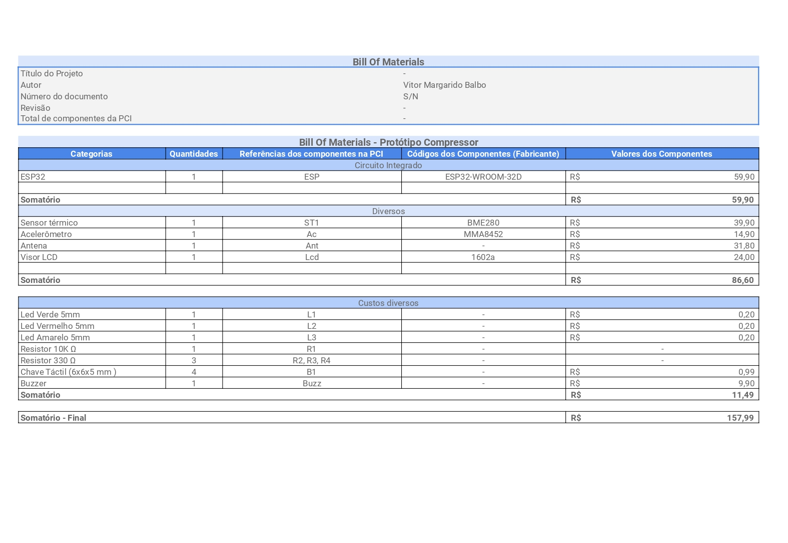 
Fonte: Material produzido pelos autores (2024)

**Para o protótipo do compressor:**  

### 1. Circuito Integrado
- **ESP32**  
  - **Descrição**: Microcontrolador com conectividade Wi-Fi e Bluetooth.  

---

### 2. Diversos
- **Sensor térmico (BME280)**  
  - **Descrição**: Sensor de temperatura e umidade de alta precisão.  

- **Acelerômetro (MMA8452)**  
  - **Descrição**: Sensor de aceleração em três eixos, utilizado para monitoramento de vibrações.

- **Antena**
  - **Descrição**: Antena utilizada para conectividade Wifi do projeto.

- **Visor LCD (1602a)**
  - **Descrição**: Display LCD utilizado para exibição de informações.

---

### 3. Custos Diversos

- **LED Verde 5mm**  
  - **Descrição**: LED para indicação visual de funcionamento.  

- **LED Vermelho 5mm**  
  - **Descrição**: LED para indicação visual de desligamento.  

- **LED Amarelo 5mm**  
  - **Descrição**: LED para indicação de status de atenção.  

- **Resistor 10K Ω**  
  - **Descrição**: Resistor utilizado para controle de corrente em circuitos.  

- **Resistor 330 Ω**  
  - **Descrição**: Resistor utilizado para limitar a corrente em LEDs.  

- **Chave Táctil (6x6x5 mm)**  
  - **Descrição**: Botão de pressão adicional para funcionalidades diversas.  

---

&nbsp;&nbsp;&nbsp;&nbsp;A BOM do protótipo de compressor destaca o ESP32 como componente central, que oferece capacidade de conectividade e processamento para o projeto. O sensor térmico (DHT22) e o acelerômetro (WH-616) adicionam funcionalidades críticas para monitoramento e controle das variáveis de temperatura e aceleração, elementos importantes para o desenvolvimento de um compressor inteligente. Esses componentes formam a base para um sistema que pode monitorar em tempo real o desempenho do compressor, identificando possíveis falhas ou variações de funcionamento que necessitem de ajustes. O valor total estimado permite que a equipe tenha uma visão clara do investimento necessário para o protótipo, garantindo que o projeto permaneça dentro do orçamento.

&nbsp;&nbsp;&nbsp;&nbsp;A lista de custos diversos é composta por componentes menores, como LEDs de diferentes cores e resistores, que são fundamentais para a construção de circuitos e indicadores visuais de status do dispositivo. Esses itens, mesmo que sejam de baixo custo, contribuem para a construção do protótipo, já que permitem verificar o estado de operação do compressor em diferentes condições. (Figura 8).

Figura 8 - Bill of Material - Prensa (BOM)  
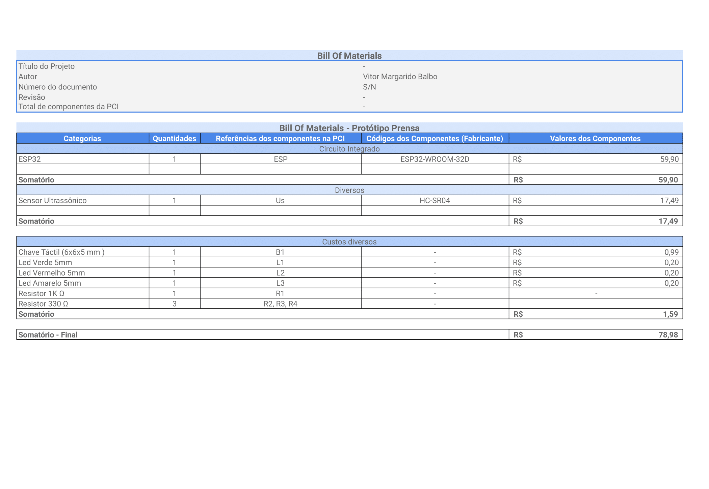 
Fonte: Material produzido pelos autores (2024)

**Para o protótipo da prensa:**  

### 1. Circuito Integrado
- **ESP32**  
  - **Descrição**: Microcontrolador com conectividade Wi-Fi e Bluetooth.  

### 2. Diversos
- **Sensor Ultrassônico (HC-SR04)**  
  - **Descrição**: Sensor de distância, utilizado para monitoramento de movimentação da prensa.  

### 3. Custos Diversos
- **Chave Táctil (6x6x5 mm)**  
  - **Descrição**: Botão de pressão utilizado para acionamento de funções.  

- **LED Verde 5mm**  
  - **Descrição**: LED para indicação visual de funcionamento.  

- **LED Vermelho 5mm**  
  - **Descrição**: LED para indicação visual de desligamento.  

- **LED Amarelo 5mm**  
  - **Descrição**: LED para indicação de status de atenção.  

- **Resistor 10K Ω**  
  - **Descrição**: Resistor utilizado para controle de corrente em circuitos.  

- **Resistor 330 Ω**  
  - **Descrição**: Resistor utilizado para limitar a corrente em LEDs.  

- **Chave Táctil (6x6x5 mm)**  
  - **Descrição**: Botão de pressão adicional para funcionalidades diversas.  

&nbsp;&nbsp;&nbsp;&nbsp;A BOM do protótipo de prensa também conta com o ESP32 como núcleo de controle, provendo capacidade de processamento e conectividade para a solução IoT. Além disso, o sensor ultrassônico (HC-SR04) é um elemento importante para esse tipo de protótipo, pois permite a medição precisa de distâncias, o que pode ser essencial para o monitoramento de deslocamentos ou do estado da prensa em operação. Esses componentes, juntos, formam a base para um protótipo eficiente e funcional, capaz de realizar o monitoramento automatizado da operação da prensa, contribuindo para a segurança e precisão do equipamento.

&nbsp;&nbsp;&nbsp;&nbsp;A lista de custos diversos é composta por componentes menores, como LEDs de diferentes cores e resistores, que são fundamentais para a construção de circuitos e indicadores visuais de status do dispositivo. Esses itens, mesmo que sejam de baixo custo, contribuem para a construção do protótipo, já que permitem verificar o estado de operação do compressor em diferentes condições.

&nbsp;&nbsp;&nbsp;&nbsp;Para que fosse feita a lista final da _BOM_, o grupo discutiu, juntamente com pesquisas e necessidades de cumprimento de requisitos, que seria necessário fazer dois protótipos separados, um para cada máquina presente no laboratório. Cada uma das listas de materiais foi cuidadosamente pensada e discutida para criar uma solução prática para o laboratório do IPT que fosse, ao mesmo tempo, funcional e com o máximo de custos reduzidos para a produção. 

&nbsp;&nbsp;&nbsp;&nbsp;Por fim, a formulação da Bill of Material é uma etapa importante para projetos que envolvem a compra de produtos físicos para a montagem de um protótipo. Com uma lista específica, colaboradores e gestores têm acesso ao escopo completo e objetivo dos recursos necessários para a execução do projeto. Para esse projeto, a utilização da _BOM_, juntamente com informações extraídas de diversos sites de compra online, permitiu estimar um valor total de custos. Embora seja uma estimativa, esse valor fornece uma base confiável para o planejamento financeiro e para a tomada de decisões. Além disso, a _BOM_ traz dados importantes sobre a quantidade de componentes necessários por placa de circuito impresso (PCB). Essa informação é importante para garantir uma montagem eficiente, evitando erros ou gastos adicionais. Assim, a _Bill of Material_ facilita o planejamento e a organização, e serve como uma maneira prática para garantir a execução bem-sucedida do projeto.

## 3.2. Domínio de Fundamentos de Experiência de Usuário 

### 3.2.1. Personas

&nbsp;&nbsp;&nbsp;&nbsp;Personas são perfis semifictícios que representam os usuários ideais de um produto ou serviço.Ao utilizar personas, as equipes de projeto conseguem direcionar suas soluções de maneira mais eficaz, garantindo que cada funcionalidade atenda diretamente às expectativas e necessidades dos usuários. Isso não apenas facilita o design de experiências mais intuitivas e agradáveis, mas também ajuda a alinhar os esforços das diversas áreas envolvidas no projeto. Dessa forma, as personas se tornam uma ferramenta para identificar problemas, explorar oportunidades e aumentar as chances de sucesso da solução desenvolvida. (André Siqueira, 2024)[10](#foot10).  
&nbsp;&nbsp;&nbsp;&nbsp;Com isso, nós desenvolvemos duas personas para a problemática trazida pelo IPT, pautando as informações delas no TAPI, na apresentação institucional e no *kickoff*. (Figura 9).

Figura 9 - Persona 1 - Alana 
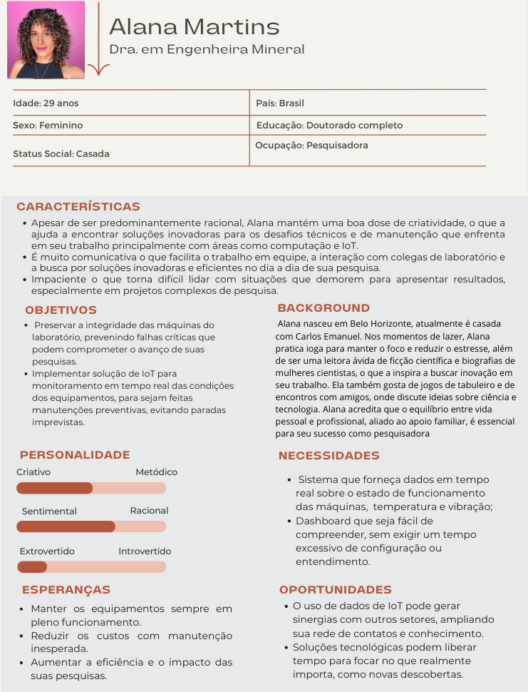 
Fonte: Material produzido pelos autores (2024)

&nbsp;&nbsp;&nbsp;&nbsp;A imagem acima apresenta a persona Alana Martins, uma engenheira mineral brasileira de 29 anos, doutorada, casada e atuante como pesquisadora. Alana combina um perfil racional e criativo, o que a torna habilidosa na resolução de problemas técnicos e na busca por soluções inovadoras, especialmente em áreas como IoT e computação. Comunicativa e colaborativa, ela valoriza o trabalho em equipe, mas se mostra impaciente com processos que retardem os resultados, principalmente em projetos complexos. Seu principal objetivo é garantir a integridade e o funcionamento contínuo das máquinas de laboratório, com um foco específico em manutenção preventiva e monitoramento em tempo real. Fora do ambiente de trabalho, Alana busca equilíbrio entre vida pessoal e profissional, dedicando-se a hobbies como leitura de ficção científica, ioga e jogos de tabuleiro. Para facilitar seu trabalho, ela precisa de um sistema de monitoramento que forneça dados em tempo real e um dashboard intuitivo. Ela também enxerga oportunidades para integrar dados de IoT com outros setores, o que poderia ampliar seu conhecimento e contribuir com novas descobertas. (Figura 10).

Figura 10 - Persona 2 - Pablo 
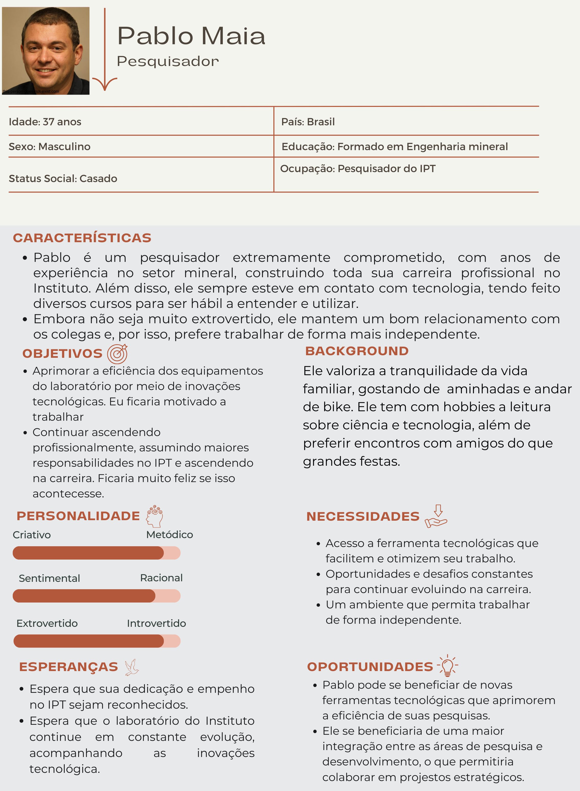 
Fonte: Material produzido pelos autores (2024)

&nbsp;&nbsp;&nbsp;&nbsp;A imagem acima apresenta Pablo Maia, um pesquisador de 37 anos, casado, brasileiro e com sólida formação em Engenharia Mineral. Pablo possui uma carreira consolidada no Instituto de Pesquisa e Tecnologia (IPT), onde demonstra comprometimento e experiência no setor mineral. Com um perfil mais reservado, ele mantém boas relações com os colegas, mas prefere trabalhar de forma independente. Seus objetivos incluem aprimorar a eficiência dos equipamentos do laboratório por meio de inovações tecnológicas e continuar crescendo profissionalmente, assumindo responsabilidades mais altas no IPT. Fora do trabalho, ele valoriza a tranquilidade da vida familiar e dedica seu tempo livre a caminhadas, ciclismo e leitura sobre ciência e tecnologia. Pablo busca ferramentas que facilitem e otimizem seu trabalho, além de oportunidades que sustentem seu desenvolvimento profissional. Ele também identifica o potencial de novas tecnologias para melhorar a eficiência de suas pesquisas e vê na integração com outras áreas uma chance de colaborar em projetos estratégicos.

&nbsp;&nbsp;&nbsp;&nbsp;Para um entender de forma mais profunda o comportamento, as necessidades, os pensamentos e os sentimentos da persona, foi desenvolvido um mapa de empatia. Esse mapa serve para desenvolvimento do projeto com o pensamento no lugar do usuário, permitindo que se compreenda melhor como ele enxerga o mundo, quais são suas dores, expectativas e motivações. (Figura 11 e 12). 

Figura 11 - Mapa de empatia - Alana 
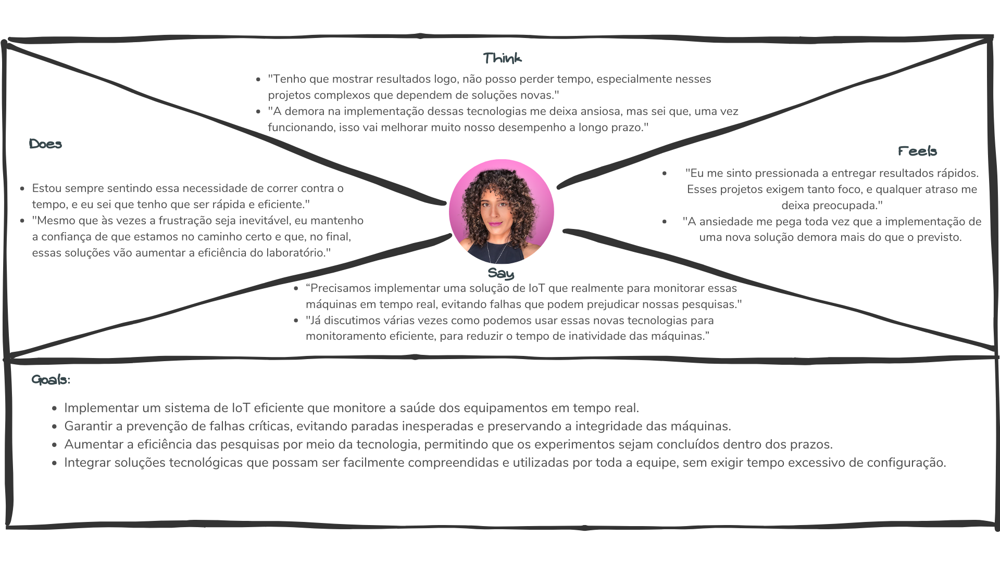 
Fonte: Material produzido pelos autores (2024)

Figura 12 - Mapa de empatia - Pablo 
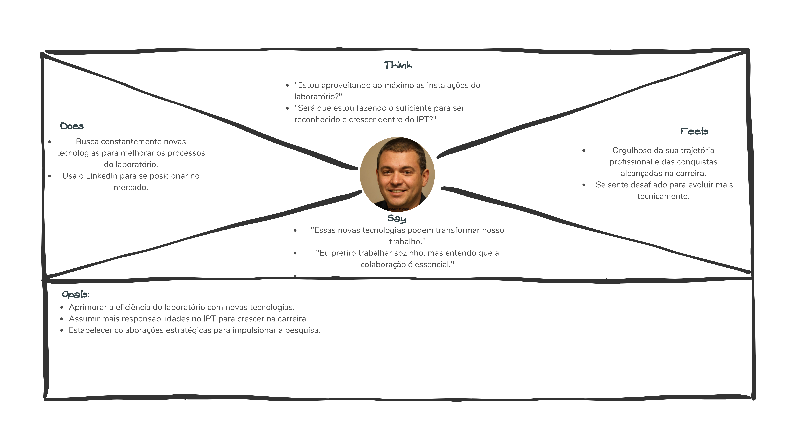 
Fonte: Material produzido pelos autores (2024)

&nbsp;&nbsp;&nbsp;&nbsp;Em conclusão, as personas desenvolvidas para o projeto do IPT proporcionam uma visão clara e focada dos usuários ideais, permitindo que as soluções sejam criadas de maneira alinhada às suas necessidades. Com base nessas representações, as equipes podem trabalhar de forma mais integrada e eficiente, garantindo que o produto final seja útil, acessível e capaz de resolver os problemas propostos. Através do uso dessas personas, o processo de desenvolvimento se torna mais orientado e preciso, contribuindo para um resultado que não apenas atende, mas supera as expectativas dos usuários. Podemos utilizar as personas como guias para a criação de tasks específicas que atendam diretamente às necessidades e objetivos dos usuários. Por exemplo, uma persona com pouca familiaridade em tecnologia pode orientar a criação de uma task focada na simplificação da interface, tornando o acesso às funcionalidades mais direto. Cada tarefa é associada a um objetivo da persona, facilitando a priorização das atividades. Dividir as tasks em frações menores, garantindo que o desenvolvimento seja direcionado e reflita as expectativas reais dos usuários.

### 3.2.2. Jornada do Usuário e Storyboard

&nbsp;&nbsp;&nbsp;&nbsp;A Jornada do Usuário é uma ferramenta utilizada para compreender detalhadamente as interações e experiências dos usuários ao utilizar o sistema. Esse recurso mapeia as etapas percorridas, desde o primeiro contato até a conclusão de suas ações, destacando pensamentos e sentimentos ao longo do processo. Seu principal objetivo é compreender as necessidades e expectativas dos usuários, facilitando a identificação de áreas de melhoria e novas oportunidades. Foram utilizadas diversas ferramentas para a confecção da jornada do usuário, podemos destacar a discussão em grupo, kick-off com o parceiro e pesquisa em fontes externas. (Objectives, 2023)[9](#foot0).

&nbsp;&nbsp;&nbsp;&nbsp;Alana Martins é uma pesquisadora do IPT, responsável por monitorar o funcionamento de um compressor, garantindo que ele opere de maneira contínua e sem falhas. Ela precisa verificar regularmente o desempenho do equipamento e quando necessário, agendar revisões preventivas. Alana espera contar com um sistema que permita o monitoramento constante do compressor, tornando o processo mais ágil e confiável, e reduzindo as chances de falhas inesperadas. Seu objetivo é ter uma solução eficiente que ofereça informações em tempo real, permita ajustes rápidos e facilite a manutenção preventiva. (Figura 13).

Figura 13 - Jornada do usuário - Persona 1  
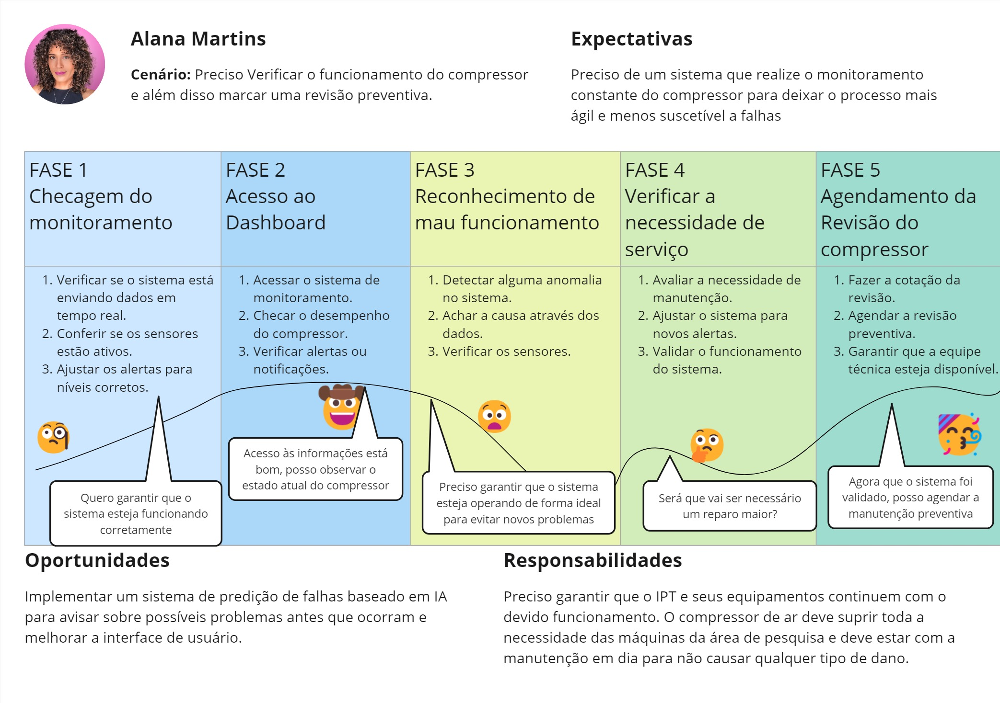 
Fonte: Material produzido pelos autores (2024)

&nbsp;&nbsp;&nbsp;&nbsp;Fases da Jornada e Linha de Sentimentos:

**Fase 1 - Checagem do Monitoramento:**

&nbsp;&nbsp;&nbsp;&nbsp;Alana começa a jornada em um estado positivo, sentindo-se confiante ao verificar se o sistema está enviando dados em tempo real, com sensores ativos e alertas ajustados. Neste momento, sua satisfação está elevada, pois ela sente que o sistema está funcionando corretamente.

**Fase 2 - Acesso ao Dashboard:**

&nbsp;&nbsp;&nbsp;&nbsp;Ao acessar o sistema de monitoramento para checar o desempenho do compressor e verificar alertas, Alana permanece em um estado emocional estável e positivo. Ela tem controle sobre o processo e encontra-se tranquila, o que representa um leve pico de confiança na linha de sentimentos.

**Fase 3 - Reconhecimento de Mau Funcionamento:**

&nbsp;&nbsp;&nbsp;&nbsp;Neste ponto, Alana identifica uma anomalia e precisa investigar a causa. Esse momento gera um vale na linha de sentimentos, indicando uma queda em sua satisfação. Ela sente preocupação, pois o possível problema exige atenção imediata para evitar falhas maiores, o que causa um pico de frustração.

**Fase 4 - Verificar a Necessidade de Serviço:**

&nbsp;&nbsp;&nbsp;&nbsp;Alana toma medidas para avaliar a necessidade de manutenção e ajustar o sistema. Esse processo a deixa um pouco mais aliviada, e a linha de sentimentos começa a subir novamente, refletindo uma redução na frustração, embora ainda permaneça cautelosa. Ela percebe que o problema está sob controle e pode ser resolvido com uma manutenção adequada.

**Fase 5 - Agendamento da Revisão do Compressor:**

&nbsp;&nbsp;&nbsp;&nbsp;Alana conclui o processo com a cotação da revisão, assegurando a preparação do equipamento para o próximo ciclo de operação. Aqui, a linha de sentimentos atinge um pico positivo, pois Alana se sente satisfeita e realizada, tendo cumprido sua responsabilidade de garantir o bom funcionamento do compressor.

**Oportunidades:**

&nbsp;&nbsp;&nbsp;&nbsp;Implementar um sistema de predição de falhas baseado em IA para alertar sobre possíveis problemas antes que ocorram e melhorar a interface do usuário, facilitando o acompanhamento de Alana.

**Responsabilidades:**

&nbsp;&nbsp;&nbsp;&nbsp;Alana precisa garantir que o IPT e seus equipamentos estejam em pleno funcionamento. O compressor da área de pesquisa precisa de manutenções regulares para evitar que a falta de revisões afete as operações e cause problemas técnicos.

&nbsp;&nbsp;&nbsp;&nbsp;Pablo Maia é um profissional que precisa monitorar o estado das máquinas no laboratório para garantir que estejam operando corretamente. Ele deseja um sistema que permita acessar rapidamente informações sobre o funcionamento das máquinas, identificando indicadores e recebendo alertas de manutenção. Pablo espera que o sistema seja fácil de usar e intuitivo, permitindo que ele compreenda o estado de cada máquina com agilidade e receba notificações sempre que houver necessidade de manutenção. Sua prioridade é uma solução eficiente que o ajude a agir rapidamente para evitar problemas maiores e garanta a operação contínua das máquinas. (Figura 14).

Figura 14 - Mapa de jornada - Pablo 
 
Fonte: Material produzido pelos autores (2024)

Fases da Jornada e Linha de Sentimentos:

**Fase 1 - Exploração do Sistema:**

&nbsp;&nbsp;&nbsp;&nbsp;Pablo acessa o sistema pela primeira vez, registra-se, faz login e explora a interface para entender as funcionalidades básicas. Neste momento, ele espera que o sistema seja fácil de usar e que não tome muito de seu tempo. Sentimento: A linha de sentimentos começa em um estado neutro e levemente positivo, pois ele está confiante, mas curioso sobre o funcionamento do sistema.

**Fase 2 - Visualização dos Status das Máquinas:**

&nbsp;&nbsp;&nbsp;&nbsp;Pablo acessa o painel de status, identificando os indicadores de funcionamento das máquinas. Ele explora informações específicas, como temperatura e tempo de uso. Sua expectativa é que esses indicadores o alertem sobre possíveis problemas. Sentimento: A linha de sentimentos mostra um leve pico positivo, já que Pablo sente segurança ao visualizar dados detalhados e sente que o sistema atende sua necessidade de monitoramento.

**Fase 3 - Identificação de Problemas:**

&nbsp;&nbsp;&nbsp;&nbsp;Pablo nota alguns alertas indicando a necessidade de manutenção em certas máquinas. Ele verifica os detalhes sobre as condições e o tipo de manutenção necessário. Esse momento é crítico, pois ele precisa confiar que os alertas são precisos. Sentimento: A linha de sentimentos apresenta um vale de preocupação, refletindo uma leve frustração e cautela, mas ao mesmo tempo um alívio ao perceber que o sistema está cumprindo sua função de alertá-lo para evitar problemas maiores.

**Fase 4 - Planejamento e Ação:**

&nbsp;&nbsp;&nbsp;&nbsp;Pablo comunica-se com a equipe de manutenção e desliga a máquina para que a manutenção possa ser realizada. Ele sente que está agindo de forma proativa com o suporte do sistema. Sentimento: A linha de sentimentos volta a subir, pois ele sente uma combinação de alívio e realização ao solucionar o problema antes que ele se agrave.

**Fase 5 - Revisão Contínua:**

Pablo revisa o sistema periodicamente para verificar a situação das máquinas, e também fornece feedback sobre a facilidade de uso do sistema, sugerindo melhorias. Ele se sente cada vez mais familiarizado com o sistema. Sentimento: A linha de sentimentos atinge um pico de satisfação, pois ele sente que o sistema se tornou uma ferramenta confiável e que ele agora está totalmente adaptado a ela.

**Oportunidades:**

&nbsp;&nbsp;&nbsp;&nbsp;Uma oportunidade identificada é levar a aplicação para dispositivos móveis, permitindo que os usuários recebam notificações sobre o estado das máquinas diretamente no celular, facilitando a mobilidade e o acompanhamento remoto.

**Responsabilidades:**
- Equipe de Desenvolvimento: Criar uma interface intuitiva com indicadores visuais claros do estado das máquinas.
- Equipe de Manutenção: Atualizar regularmente os dados das máquinas e reagir aos alertas programados para garantir o bom funcionamento.

&nbsp;&nbsp;&nbsp;&nbsp;Logo, ao utilizar os mapas de jornada acima, podemos desenvolver de uma visão mais aprofundada das necessidades e expectativas dos usuários em cada fase de interação com o sistema de IoT. Esses mapas fornecem uma estrutura que orienta o *design* e a funcionalidade da plataforma, permitindo o desenvolvimento de interfaces intuitivas, alertas proativos e uma melhor interface para fácil navegação. Além disso, os *insights* obtidos com a jornada possibilitam identificar e corrigir potenciais erros, dessa maneira otimizado e melhorando significativamente o projeto. Podemos utilizar os mapas de jornada do usuário como guias para a criação de tasks que atendam diretamente às necessidades e expectativas dos usuários em cada etapa de interação com o sistema. Por exemplo, uma etapa inicial da jornada pode indicar a necessidade de simplificar o processo de cadastro, orientando a criação de uma task focada na clareza das instruções e na facilidade de uso. Cada etapa da jornada é associada a um objetivo específico, facilitando a priorização das atividades e a identificação de pontos de melhoria. Dividir as tasks em partes menores permite um desenvolvimento mais direcionado, garantindo que o sistema reflita com precisão a experiência e os objetivos dos usuários.

#### Storyboard

&nbsp;&nbsp;&nbsp;&nbsp;Um storyboard é uma sequência de ilustrações ou imagens organizadas em ordem cronológica que representa visualmente como o usuário interage com nosso produto. Originalmente usado na produção de filmes e animações, o storyboard agora é amplamente adotado no design de produtos, publicidade e desenvolvimento de software para planejar a experiência do usuário e ilustrar, quadro a quadro, o uso e a navegação pelo produto.

&nbsp;&nbsp;&nbsp;&nbsp;No desenvolvimento do projeto, o storyboard é importante para visualizarmos a jornada do usuário antes da implementação, facilitando a identificação de melhorias e ajustes no fluxo. Cada quadro ilustra uma interação, alinhando a visão entre a equipe e garantindo que todos compreendam o produto final. Ele permite validações rápidas e feedback antes do desenvolvimento, ajudando a resolver problemas antecipadamente e assegurando que a experiência do usuário esteja alinhada com os objetivos do projeto.

&nbsp;&nbsp;&nbsp;&nbsp;Para construir os storyboards, seguimos uma metodologia colaborativa, começando com uma discussão em grupo baseada nas informações levantadas durante o kick-off. Nessa etapa inicial, todos os envolvidos — incluindo desenvolvedores, designers e stakeholders — contribuíram com suas perspectivas, assegurando uma visão ampla das necessidades do usuário e dos objetivos do projeto. Com base no material do kick-off, mapeamos as principais etapas da jornada do usuário e discutimos como cada uma deveria ser representada nos storyboards. 

&nbsp;&nbsp;&nbsp;&nbsp;Esse processo incluiu a definição dos pontos de interação, as reações esperadas do usuário e os possíveis problemas de usabilidade. A partir daí, criamos esboços de cada quadro, representando as ações e os feedbacks visuais que o sistema deve oferecer. Esses esboços foram revisados em grupo para garantir que a sequência estivesse clara e em linha com as expectativas e necessidades identificadas.

&nbsp;&nbsp;&nbsp;&nbsp;Um exemplo prático de como o storyboard ajuda no projeto seria imaginar o processo de monitoramento de uma máquina pelo usuário. No storyboard, criamos quadros que mostram o usuário acessando o painel, visualizando o status da máquina e recebendo alertas em caso de falhas. (Figura 15 e 16).

Figura 15 - Storyboard - Alana Martins 
 
Fonte: Material produzido pelos autores (2024)

&nbsp;&nbsp;&nbsp;&nbsp; O storyboard 1 demonstra como a Alana interage com o sistema IoT desenvolvido para o compresor de ar do IPT.
- **1.** &nbsp;Alana Martirns recebe um alerta sobre o compressor de ar, identificando a necessidade da troca de óleo.
- **2.** &nbsp; Alana avisa a equipe de manutenção sobre a necessidade de trocar o óleo do compressor.
- **3.**&nbsp; A equipe de manutenção chega até o compressor para realizar a troca.
- **4.**&nbsp; O compressor tem o óleo trocado e volta a pleno funcionamento.
- **5.**&nbsp; O responsável pela manutenção realiza uma atualização no sistema.
- **6.**&nbsp; Alana volta ao seu trabalho.

Figura 16 - Storyboard - Pablo Maia 
 
Fonte: Material produzido pelos autores (2024)

&nbsp;&nbsp;&nbsp;&nbsp; O storyboard 2 demonstra como Pablo interage com o sistema IoT desenvolvido para a prensa do IPT.
- **1.**&nbsp; Pablo Maia está em seu ambiente de trabalho realizando seus afazeres. 
- **2.**&nbsp; Pablo recebe um alerta relacionado a situação da prensa.
- **3.**&nbsp; Ele vai checar a prensa para averiguar a situação e percebe que a prensa precisa de manutenção.
- **4.**&nbsp; Pablo liga para a equipe de manutenção e comunica sobre a situação da prensa.
- **5.**&nbsp; A equipe de manutenção chega e realiza os reparos necessários para o funcionamento da prensa.
- **6.**&nbsp; A prensa volta ao seu funcionamento pleno e Pablo volta ao seu trabalho.

&nbsp;&nbsp;&nbsp;&nbsp;Com esses quadros, podemos ver se as telas estão intuitivas e se as informações aparecem de forma clara no momento certo. Por exemplo, se notamos que o alerta de falha não é imediatamente visível, podemos ajustar o layout antes de começar a programar. Assim, o storyboard ajuda a prever problemas de usabilidade e garante que a experiência do usuário final seja eficiente e alinhada com os objetivos de monitoramento do projeto.

&nbsp;&nbsp;&nbsp;&nbsp;Em resumo, o storyboard é uma ferramenta essencial para planejar e comunicar de forma visual a jornada do usuário e o fluxo de um processo. Ele possibilita um melhor entendimento do uso tanto do IoT desenvolvido para o compressor de ar quanto para o desenvolvido para a prensa, facilitando o entendimento da jornada do usuário.Logo, ao utilizar o storyboard, é possível identificar e resolver problemas antecipadamente, garantindo que a experiência do usuário seja mais fluida e que o resultado final esteja alinhado com os objetivos do projeto.

## 3.3. Solução Técnica	

&nbsp;&nbsp;&nbsp;&nbsp;Nesta seção, são apresentados os principais aspectos técnicos do desenvolvimento da solução proposta, abrangendo desde os requisitos funcionais e não funcionais até a definição das arquiteturas em diferentes níveis de detalhamento.

### 3.3.1. Requisitos Funcionais  
&nbsp;&nbsp;&nbsp;&nbsp;Os requisitos funcionais definidos para o sistema de monitoramento de equipamentos atendem diretamente às necessidades do parceiro (IPT) e garantem a segurança e eficiência operacionais. Cada requisito foi elaborado considerando não apenas a funcionalidade básica, como monitoramento em tempo real e geração de alertas, mas também protocolos de segurança que detalham ações específicas em situações críticas e controle rigoroso de acesso. Assim, os requisitos funcionais são detalhados na tabela abaixo. (Quadro 1)

  
Quadro 1 - Requisitos Funcionais    

| **RF#** | **Descrição** | **Regra de Negócio** | **Ações Previstas** |  
|----------|---------------|----------------------|--------------------|  
| RF01 | O sistema deve monitorar e exibir a temperatura dos equipamentos em tempo real. | O dispositivo deve realizar leituras contínuas da temperatura usando o sensor DS18B20, com uma frequência de 1 segundo enquanto o equipamento estiver ligado. | Exibir temperatura em tempo real no dashboard, atualizando a cada segundo. O operador deve ser notificado caso o dispositivo perca a leitura de temperatura. |  
| RF02 | O sistema deve gerar alertas visuais e sonoros quando a temperatura ultrapassar o limite de 70°C. | Quando a temperatura ultrapassar 70°C, o dispositivo deve acionar um alerta sonoro e/ou visual que permanecerá ativo até que a temperatura retorne a níveis seguros. | Exibir aviso visual e ativar alarme sonoro ao atingir o limite. Enviar notificação para o operador e, se a temperatura permanecer crítica por 10 minutos, iniciar protocolo de desligamento automático (opção de cancelamento disponível ao operador). |  
| RF03 | O sistema deve registrar e armazenar os dados de operação, como temperatura e número de ciclos. | A cada 10 segundos, o dispositivo deve registrar a temperatura e o número de ciclos. Os dados devem ser armazenados localmente e enviados ao servidor quando a rede estiver disponível. | Caso haja falha de rede, os dados serão mantidos localmente e enviados posteriormente. Logs de leitura devem ser armazenados com data e hora para auditoria. |  
| RF04 | O dashboard deve apresentar os dados de operação de forma gráfica, incluindo curvas de temperatura e alertas críticos. | O dashboard deve oferecer gráficos que permitam ao operador acompanhar o histórico e o status atual dos equipamentos, com destaque para eventos de alerta e status de segurança. | O histórico de temperatura e alertas deve ser visualizado graficamente no dashboard. Alterações de estado, como ativação de alertas, são registradas e exibidas com destaque. |  
| RF05 | O sistema deve permitir que técnicos autorizados configurem o limite de temperatura de operação. | Técnicos com permissões adequadas devem poder ajustar o limite padrão de 70°C, conforme as especificações de segurança. Esse ajuste deve ser registrado para garantir rastreabilidade. | Apenas técnicos e supervisores podem modificar limites de temperatura. Alterações são registradas no sistema com data, hora e usuário responsável. 

   
Fonte: Material produzido pelos autores (2024)  

  

&nbsp;&nbsp;&nbsp;&nbsp;Essas especificações asseguram que o sistema fornecerá informações precisas e oportunas para os operadores, ao mesmo tempo em que mantém os dados protegidos e a operação dos equipamentos monitorada sob condições seguras. A implementação adequada desses requisitos contribuirá para um ambiente de trabalho mais seguro e facilitará a análise de dados e auditorias futuras, além de garantir a continuidade e integridade dos processos de monitoramento e manutenção.  

### 3.3.2. Requisitos Não Funcionais

&nbsp;&nbsp;&nbsp;&nbsp;Os requisitos não funcionais são restrições aplicadas aos requisitos funcionais, ou seja, são limitações sobre os serviços ou funções oferecidos pelo sistema, incluindo restrições de tempo e processos de desenvolvimento, geralmente impostas por normas. Nos requisitos abaixo, utilizamos a norma ISO 25010, que define a qualidade essencial para todos os sistemas. Essa norma especifica oito características necessárias para um software de qualidade:  

- **Adequação Funcional**: Funcionalidades oferecidas pelo software que permitem ao usuário realizar suas tarefas.  
- **Eficiência**: Capacidade do software de fornecer recursos adequados para assegurar um desempenho apropriado.  
- **Compatibilidade**: Capacidade do produto de compartilhar informações com outros produtos, sistemas ou componentes.  
- **Usabilidade**: Refere-se à acessibilidade do software, considerando aspectos como compreensão, aprendizado e uso, de modo que o usuário atinja seus objetivos com eficiência e satisfação.  
- **Confiabilidade**: Refere-se à capacidade do software de evitar falhas e manter-se em funcionamento mesmo quando estas ocorrem, dentro de um período de tempo determinado.  
- **Segurança**: Capacidade do produto de proteger informações, garantindo um nível adequado de segurança.  
- **Manutenibilidade**: Relaciona-se à facilidade com que o produto pode ser aprimorado, adaptado ou corrigido de forma eficiente.  
- **Portabilidade**: Grau de eficiência com que o software pode ser transferido de um hardware, software ou sistema para outro.  

&nbsp;&nbsp;&nbsp;&nbsp;Nesse contexto, o grupo definiu os requisitos não funcionais do dispositivo *IoT* (Quadro 2):  

  
Quadro 2 - Requisitos não funcionais     

| **RNF#** | **Descrição** | **Aspecto de qualidade** | **Teste** |  
|----------|---------------|-----------------------------|----------|  
| RNF01 | O manual de instrução deve fornecer imagens claras, visando a acessibilidade e maior entendimento para o parceiro de projeto | Usabilidade | Mostrar o manual para os usuários e avaliar se eles conseguem compreender a forma correta de se utilizar o equipamento. |  
| RNF02 | A solução deve ser intuitiva, permitindo que os usuários entendam como é feito o monitoramento das máquinas. Assim, facilitando o aprendizado, a acessibilidade e o *User Experience* da interface | Usabilidade | Observar como um novo usuário se comporta e o quão intuitivo é o uso do aparelho. |  
| RNF03 | O sistema deve garantir integridade e precisão dos dados armazenados | Segurança | Realizar testes para identificar possíveis inconsistências ou erros nos dados durante o processamento e armazenamento. |  
| RNF04 | Código-fonte documentado e comentado | Manutenibilidade | Realizar testes do código e identificar possíveis erros na hora de rodar o código. |  
| RNF05 | O sistema deve estar disponível para monitoramento contínuo durante 99,5% do tempo | Confiabilidade | Monitorar o sistema durante um período de tempo prolongado e registrar os tempos de inatividade. |  
   
Fonte: Material produzido pelos autores (2024)  

  

&nbsp;&nbsp;&nbsp;&nbsp;Dessa forma, a definição dos requisitos não funcionais é importante para garantir que nossa solução não apenas funcione, mas também cumpra os padrões de eficiência, compatibilidade, usabilidade, confiabilidade, segurança, manutenibilidade e portabilidade. Esses requisitos são essenciais para definir a qualidade do sistema, tornando-o mais eficiente.  

### 3.3.3. Arquitetura da Solução

&nbsp;&nbsp;&nbsp;&nbsp;A arquitetura de solução define a estrutura e a organização dos componentes de um sistema para atender aos requisitos de um projeto. No contexto atual, em que se desenvolveu dois dispositivo IoT para monitoramento de máquinas, a arquitetura de solução especifica os elementos essenciais para capturar, processar e transmitir dados das máquinas monitoradas até um _dashboard_ remoto. Essa estrutura permite uma comunicação eficiente entre os sensores, microcontroladores e sistemas de comunicação, garantindo que as informações das máquinas sejam coletadas em tempo real, transmitidas via protocolo MQTT e apresentadas ao usuário final em uma interface intuitiva. Dessa forma, a arquitetura visa não só monitorar as condições das máquinas, mas também facilitar intervenções rápidas e embasadas quando necessário. (Wesley Willians, 2022)[11](#foot11). (Figura 17).

Figura 17 - Arquitetura de Solução
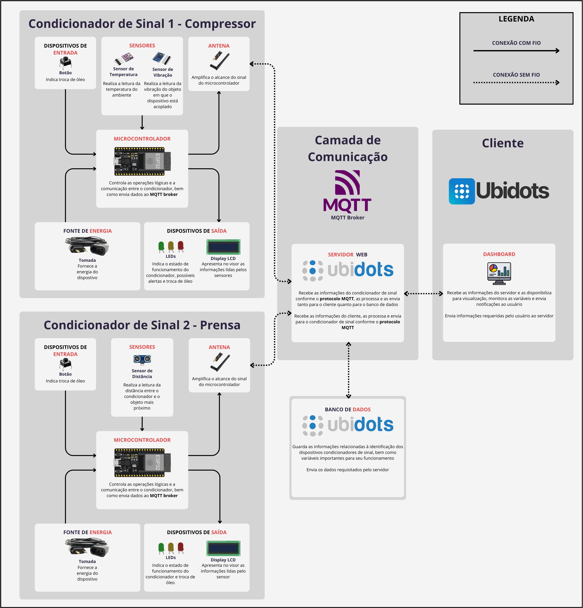
Fonte: Material produzido pelos autores (2024)

 

[_Link_ do vídeo de explicação da arquitetura de solução](https://youtu.be/M15tbPMPA0Q)

&nbsp;&nbsp;&nbsp;&nbsp;A arquitetura da solução consiste em uma rede de sensores conectados a dispositivos de monitoramento, configurados para observar o funcionamento de duas máquinas: um compressor e uma prensa. Cada máquina possui seu próprio condicionador de sinal, que coleta e processa dados de diferentes sensores antes de transmitir essas informações para um sistema central de monitoramento.

&nbsp;&nbsp;&nbsp;&nbsp;O condicionador de sinal do compressor conta com sensores de temperatura e vibração, que detectam variações térmicas no ambiente e mudanças de vibração no equipamento, indicando possíveis problemas ou necessidade de manutenção. Similarmente, o condicionador de sinal da prensa é equipado com um sensor de distância, que mede a posição do pistão, ajudando a avaliar o ciclo de operação da máquina. Em ambos os casos, os sinais dos sensores são amplificados por uma antena, aumentando o alcance do sinal dos microcontroladores, que servem como o núcleo dos condicionadores, processando dados e gerenciando as operações de comunicação com o restante da rede.

&nbsp;&nbsp;&nbsp;&nbsp;Cada condicionador deverá ser conectado à fonte de energia por meio de tomada. Além disso, os condicionadores também possuem dispositivos de entrada, que indicam o status de troca de óleo, e dispositivos de saída, como LEDs e displays LCD, para informar o status das operações e exibir as leituras dos sensores em tempo real.

&nbsp;&nbsp;&nbsp;&nbsp;A comunicação entre os condicionadores e o sistema central ocorre via protocolo MQTT, um padrão em IoT que facilita a transmissão de dados em redes com largura de banda limitada. Os dados processados pelos microcontroladores são enviados para um servidor web utilizando o broker MQTT, a camada de comunicação que atua como intermediária, garantindo que as informações sejam entregues aos servidores de forma eficiente. O servidor, hospedado na plataforma Ubidots, recebe, armazena e processa os dados, disponibilizando-os em um banco de dados e visualizando-os em um dashboard acessível ao cliente.

&nbsp;&nbsp;&nbsp;&nbsp;O banco de dados Ubidots armazena informações críticas sobre o status e a identificação dos dispositivos, permitindo ao cliente acessar relatórios e análises históricas. O dashboard é uma interface visual que permite monitorar o status das máquinas em tempo real, facilitando o gerenciamento remoto. Os dados exibidos no dashboard incluem leituras dos sensores e notificações de possíveis falhas ou necessidades de manutenção. Caso o cliente precise fazer ajustes ou enviar comandos, essas instruções podem ser transmitidas de volta ao sistema usando o protocolo MQTT, fechando o ciclo de comunicação e controle. Essa arquitetura proporciona uma solução completa de monitoramento remoto para equipamentos industriais, garantindo eficiência e manutenção preditiva.

&nbsp;&nbsp;&nbsp;&nbsp;O usuário por sua vez, tem a possibilidade de interagir tanto com o produto físico quanto o dashboard. No físico ele pode observar a coloração dos leds e o display LCD, que indicam,respectivamente, os estados e valores da máquina e suas necessidades, como situações de superaquecimento e a necessidade  da troca de óleo, que pode ser reiniciada pelo botão do dispositivo IoT. Já no dashboard o usuário pode, além de visualizar uma vasta gama de dados como o histórico da variação de temperatura e o tempo em que a máquina permaneceu ligada, reiniciar o tempo de uso da troca de óleo, facilitando o processo de interação com o IoT.

&nbsp;&nbsp;&nbsp;&nbsp;A arquitetura da solução foi projetada para atender a uma série de requisitos funcionais e não funcionais que garantem o desempenho, a usabilidade e a segurança do sistema de monitoramento. Para detalhar essa relação entre os requisitos e a estrutura técnica, foram criadas tabelas que associam cada componente arquitetural aos objetivos específicos do sistema. Essas tabelas ajudam a evidenciar como cada elemento da arquitetura contribui para alcançar os objetivos do projeto, garantindo tanto a funcionalidade esperada quanto a confiabilidade e a facilidade de uso da solução. (Quadro 3 e 4).

Quadro 3 - Relação Arquitetura x Requisitos Funcionais

| **Requisitos Funcionais** | **Motivação** |
|----------------------------|---------------|
| **RF01** | A arquitetura possui sensores de temperatura que realizam leituras em tempo real e enviam os dados para um servidor via MQTT, com exibição através do Ubidots. Isso possibilita a visualização contínua da temperatura no dashboard, atendendo ao requisito de monitoramento em tempo real. |
| **RF02** | A arquitetura inclui dispositivos de saída (LEDs) que podem ser ativados quando a temperatura ultrapassa um limite definido, possibilitando alertas visuais conforme necessário. |
| **RF03** | A arquitetura é composta por microcontroladores conectados a uma camada de comunicação MQTT e banco de dados Ubidots, permitindo que os dados coletados sejam armazenados e posteriormente enviados ao servidor, atendendo ao requisito de registro e armazenamento dos dados de operação. |
| **RF04** | A solução inclui um dashboard que permite a visualização dos dados de operação de forma gráfica e com destaque para alertas, atendendo ao requisito de apresentar o status dos equipamentos. |
| **RF05** | A arquitetura prevê o uso de um dashboard para monitoramento e controle, no qual técnicos autorizados podem ajustar o limite de temperatura e registrar essas mudanças para garantir a rastreabilidade, atendendo ao requisito de configuração de limites por usuários autorizados. |

Fonte: Material produzido pelos autores (2024)

 

Quadro 4 - Relação Arquitetura x Requisitos Não Funcionais

| Requisitos Não Funcionais | Motivação |
|--------------------------|----------------------------------------|
| **RNF01**                | A arquitetura inclui um _dashboard_ (Ubidots) que permite o acesso ao manual de instruções com imagens claras, o que auxilia parceiros do projeto a compreender o sistema e utilizar o equipamento corretamente. |
| **RNF02**                | O _dashboard_ Ubidots, por causa da interface intuitiva que possui, facilita o monitoramento das máquinas e melhora a experiência do usuário. Testes com novos usuários podem comprovar a facilidade de uso e acessibilidade do sistema. |
| **RNF03**                | A arquitetura contempla armazenamento em banco de dados Ubidots, o qual já possui medidas de segurança para garantir a proteção cibernética dos dados. Além disso, todo processo de coleta de dados realizado na arquitetura é pensado mediante a [política de privacidade](#316-política-de-privacidade-de-acordo-com-a-lgpd) já introduzida. |
| **RNF04**                | A solução utiliza microcontroladores e, portanto, _firmware_ com código fonte de autoria própria, além de uma camada de comunicação que envolve protocolos e sistemas interconectados. Em relação a esses aspectos da arquitetura, o código fonte está disponibilizado e bem documentado no caminho [`src/firmware/`](/src/firmware/). |
| **RNF05**                | A arquitetura é configurada para monitoramento contínuo tanto via dispositivo IoT, quanto via aplicação _web_ que utiliza MQTT e Ubidots, o que permite ao sistema o alcance da disponibilidade necessária. O monitoramento prolongado pode comprovar a confiabilidade da solução em atender esse requisito. |

Fonte: Material produzido pelos autores (2024)

&nbsp;&nbsp;&nbsp;&nbsp;Em conclusão, a arquitetura da solução foi pensada para integrar tecnologia IoT e monitoramento remoto de forma eficiente, atendendo a uma variedade de requisitos funcionais e não funcionais essenciais para o gerenciamento de equipamentos industriais. Com o uso de sensores específicos, microcontroladores, protocolo MQTT e a plataforma Ubidots, a solução possibilita o monitoramento em tempo real, armazenamento seguro de dados e geração de alertas visuais, garantindo tanto a disponibilidade das informações quanto a usabilidade da interface para o cliente. A estrutura modular e a compatibilidade com processos de análise de dados, bem como a documentação nítida e acessível, contribuem para a escalabilidade e manutenção do sistema, proporcionando uma experiência de usuário confiável e amigável. Assim, a arquitetura cumpre seu papel ao facilitar a manutenção preditiva e o controle remoto, promovendo uma melhor gestão dos equipamentos monitorados.

### 3.3.4. Arquitetura do Protótipo

&nbsp;&nbsp;&nbsp;&nbsp; A arquitetura do protótipo define a estrutura e a organização das tecnologias de um sistema para atender aos requisitos de um projeto. No contexto atual, em que se desenvolveu dois dispositivos IoT para monitoramento de máquinas, a arquitetura do protótipo especifica as tecnologias utilizadas, como os sensores ,microcontroladores e softwares, bem como suas funções dentro do projeto. Construir uma boa arquitetura do protótipo é extremamente importante pois proporciona uma base sólida para o desenvolvimento do projeto, o que por sua vez colabora para que o projeto atenda aos requisitos predefinidos. Dessa forma, a arquitetura do protótipo proporciona uma visão mais clara sobre o projeto IoT desenvolvido para o IPT. (Figura 18).

Figura 18 -  Arquitetura do Protótipo  
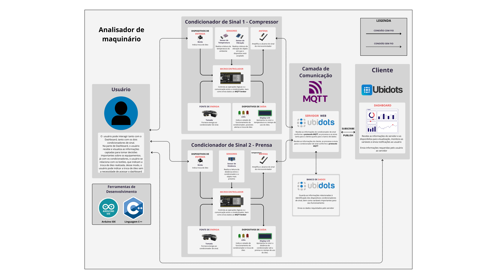
</a> 
Fonte: Material produzido pelos autores (2024)

[_Link_ do vídeo de explicação da arquitetura do protótipo](https://youtu.be/YypImvp4Vbo)

&nbsp;&nbsp;&nbsp;&nbsp;A arquitetura do protótipo consiste em um sistema de sensores conectados a dispositivos de monitoramento, projetados para observar, cada um, o funcionamento de uma de duas máquinas: um compressor e uma prensa. Cada dispositivo possui seu próprio condicionador de sinal, que coleta dados de diferentes sensores e transmite essas informações a um microcontrolador, o qual atua como sistema central. 

&nbsp;&nbsp;&nbsp;&nbsp;O condicionador de sinal do compressor utiliza sensores de temperatura e vibração para detectar variações térmicas e mudanças de vibração no equipamento, sinalizando possíveis falhas ou necessidade de manutenção. Da mesma forma, o condicionador de sinal da prensa é equipado com um sensor de distância para medir a posição do pistão, ajudando a monitorar o ciclo de operação. Em ambos, um microcontrolador ESP32 é responsável por administrar as informações a partir de um algoritmo estruturado em linguagem C++ de programação, compilado e executado pelo ambiente de desenvolvimento integrado Arduino IDE. Os dois condicionadores amplificam o alcance do sinal dos microcontroladores, transmitido via protocolo WiFi, o que permite o envio de mensagens via protocolo MQTT para o servidor Ubidots utilizado. Nesse sentido, os condicionadores de sinal utilizam de protocolos embutidos para estabelecer conexão (WiFi) e enviar mensagens (MQTT) para o servidor _web_. 

&nbsp;&nbsp;&nbsp;&nbsp;Cada dispositivo tem sua própria fonte de energia, composta por carregadores e conversores  para garantir a autonomia. Além disso, botões de pressão podem ser fisicamente utilizados para indicar troca de óleo, enquanto dispositivos de saída, LEDs, _displays_ LCD e _buzzers_ fornecem indicações visuais e sonoras sobre o status das máquinas, possíveis alertas e as leituras dos sensores. Os dados enviados ao servidor _web_ são, então, principalmente informações captadas pelos sensores, inferências sobre o estado da máquina (ligado/desligado) feitas a partir disso, tempo de uso do óleo baseado em ambas essas informações e necessidade de troca de óleo quando esse tempo excede um determinado limite. O microcontrolador recebe, ainda, informações do servidor Ubidots, também via conexão WiFi e protocolo MQTT para as mensagens, referentes à troca de óleo realizada e ajuste de parâmetros na lógica desenvolvida (como o tempo máximo para realização da troca do óleo).

 &nbsp;&nbsp;&nbsp;&nbsp;O servidor _web_ armazena, processa e envia os dados para um _dashboard_, acessível ao cliente. Dessa forma, é possível ao usuário a interação com os dados, bem como com o próprio sistema do condicionador de sinal via Internet. O banco de dados do Ubidots armazena informações críticas sobre o status e a identificação dos dispositivos com aproximadamente 1 ano de validade para cada dado, o que permite ao cliente acessar relatórios e análises temporais. O _dashboard_ oferece uma interface para monitorar as máquinas em tempo real, exibindo leituras dos sensores, necessidade de troca de óleo, tempo de uso de cada máquina e variações de distância e temperatura ao longo do tempo. Caso necessário, o cliente pode enviar comandos de volta ao sistema por meio do protocolo MQTT, completando o ciclo de comunicação e controle.

 &nbsp;&nbsp;&nbsp;&nbsp;O usuário pode interagir tanto com o produto físico quanto com o _dashboard_. No dispositivo físico, LEDs e o display LCD indicam os estados da máquina, como superaquecimento ou a necessidade de troca de óleo, com a possibilidade de reiniciar o contador de troca de óleo pelo botão do dispositivo. No _dashboard_, o usuário tem acesso a dados detalhados, como histórico de temperatura e tempo de operação da máquina, e pode gerenciar as trocas de óleo remotamente. (Quadro 5).

 

Quadro 5 - Tecnologias usadas no projeto

| **Componente**                                          | **Utilização no Projeto**                                        | **Tipo**                   |
|-----------------------------------------------------|------------------------------------------------------------------|------------------------|
| Microcontrolador Esp32 (Wroom 32U)                 | Comunicação e controle de periféricos via protocolo MQTT         | Placa                  |
| Led Amarelo                                            | Indicação visual da necessidade de troca de óleo                          | Componente             |
| Led Vermelho(compressor)                                      | Indicação visual de que a temperatura está muito alta                          | Componente             |
| Led Vermelho(prensa)                                      | Indicação visual de a prensa está desligada                      | Componente 
| Led Verde                                            | Indicação visual de que a prensa e o compressor estão ligados                          | Componente             |          |
|Sensor de temperatura  (DHT22)  | Medição de temperatura do sistema                     | Sensor                 |
|Sensor Acelerômetro (WH-616)  | Medição da vibração do compressor                     | Sensor                 |
|Sensor Ultrassônico (HC-SR04) | Sensor de distância, utilizado para monitoramento de movimentação da prensa                    | Sensor                 |
| Display LCD                                        | Exibição de dados temperatura, distância da prensa e tempo de uso de óleo                | Display                 |
| Fio de conexão (jumper)                            | Conexão entre componentes e Esp32                                | Componente             |
| Botão (pushButton)                                 | Controle de diversas condições do projeto, como zerar o tempo de uso de óleo    | Componente             |
| Regulador de Tensão Ajustável MT3608               | Realização a carga de forma segura garantindo que a tensão em cada bateria não supere a tensão máxima | Conversor              |
| Antena wi-fi (2.4Ghz 3dBi Cabo Pigtail UFL)         | Amplificação do sinal MQTT                                       | Componente             |
| Resistor 10K Ω e 330 Ω               | Limitação de corrente para melhor funcionamento                  | Componente             |
| Placa de circuito impresso                         | Conexão do Esp32 aos outros componentes                          | Componente             |
| C++                                                | Linguagem de programação para o desenvolvimento do sistema       | Linguagem de Programação|
| Arduino IDE                                        | Ambiente de desenvolvimento para o código em C++                | Ambiente de Programação|
| MQTT                                               | Protocolo de comunicação entre Ubidots e o condicionador de sinais | Protocolo              |
| Interface Ubidots                                  | Plataforma web para visualização de dados                       | Sistema Web            |

Fonte: Material produzido pelos autores (2024)

### 3.3.5. Arquitetura Refinada da Solução

A arquitetura da solução é composta por dispositivos IoT, uma camada de comunicação baseada em **MQTT** e um sistema de armazenamento e visualização **Ubidots**. Essa arquitetura foi ajustada e refinada a partir das sessões anteriores, com o objetivo de suportar de maneira sólida os requisitos funcionais e não funcionais estabelecidos.

### **Descrição Detalhada da Arquitetura**
A arquitetura da solução, realizada na sessão 3.3.3, no geral manteve-se inalterada, com alterações somente no **dashboard** para melhor visualização do usuário. Abaixo um resumo da arquitetura:

- **Sensores de entrada**: Sensores de temperatura, vibração e distância, configurados para detectar variações em tempo real.  
- **Microcontroladores ESP**: Servem como o núcleo de processamento, conectando sensores e dispositivos de saída ao sistema de comunicação wi-fi.  
- **Dispositivos de saída**: LEDs e displays LCD indicam visualmente os estados das máquinas e os dados coletados.  
- **Camada de comunicação**: Transmite os dados coletados via protocolo **MQTT** para um servidor web hospedado no Ubidots.  
- **Dashboard**: Disponibiliza os dados coletados em uma interface intuitiva, com recursos visuais, alertas de manutenção e botões para registro de troca de óleo.  

A comunicação ocorre de maneira **bidirecional**, permitindo que dados sejam enviados dos condicionadores para o servidor, enquanto comandos específicos podem ser encaminhados de volta para os dispositivos físicos. Esse ciclo fechado garante um monitoramento contínuo e a possibilidade de interação remota com as máquinas.

---

### **Alterações Implementadas**
---
**Protótipo Físico - Compressor**  
- **Cabo de rede**: Foi inserido um cabo de rede na case conectado ao acelerômetro e sensor de temperatura a fim de manter uma melhor organização e proteção aos cabos e ao protótipo.  
- **Novas Cases**: Foram adicionadas novas cases tanto para o acelerômetro quanto para o sensor de temperatura para preservar a sua vida útil. Além do mais, a case principal sofreu uma alteração para comportar o LCD de maneira mais estável.

**Dashboard**  
- Foram inseridos tanto o **tempo de uso do óleo** quanto o **tempo de uso do compressor** em minutos, para que o usuário possa ter uma visão mais detalhada da situação da máquina.  
- Adicionado também um **termômetro** para visualização da temperatura atual do compressor e um **mapa de calor** para observar a variação de temperatura ao longo do tempo.
---
**Protótipo Físico - Prensa**  
- **Case**: Para a versão final do protótipo, houve a criação de uma case física para o sistema da prensa.  

**Dashboard**  
- Foi adicionado somente o **tempo de uso da prensa** em minutos para melhor visualização.

### **Como a Arquitetura Suporta os Requisitos Funcionais e Não Funcionais**
O Quadro a seguir destaca a relação entre os requisitos funcionais, não funcionais e os componentes da arquitetura:(Quadro 6)

Quadro 6 - Relação entre requisitos funcionais, não funcionais e componentes   

| **Requisitos Funcionais** | **Componentes Técnicos Associados** | **Requisitos Não Funcionais Relacionados** | **Justificativa** |
|---------------------------|-------------------------------------|------------------------------------------|------------------|
| **RF01**: Sensores realizam leituras em tempo real e enviam os dados ao servidor MQTT para visualização no Ubidots. | Sensores, microcontroladores, protocolo MQTT, Ubidots (dashboard). | **RNF02**: Interface intuitiva do dashboard Ubidots facilita a visualização dos dados em tempo real. **RNF05**: Configuração para monitoramento contínuo via MQTT e Ubidots garante alta disponibilidade. | A funcionalidade de monitoramento em tempo real depende da disponibilidade contínua e da facilidade de uso do dashboard, garantindo que os dados possam ser visualizados e interpretados rapidamente. |
| **RF02**: Dispositivos de saída (LEDs) alertam quando a temperatura ultrapassa o limite definido. | LEDs, microcontroladores, sensores. | **RNF05**: Disponibilidade do sistema garante que alertas visuais funcionem continuamente. | A confiabilidade do monitoramento contínuo (RNF05) garante que alertas críticos (RF02) sejam exibidos em tempo real, evitando falhas no controle operacional. |
| **RF03**: Registro e armazenamento dos dados no banco Ubidots por meio de microcontroladores e MQTT. | Banco de dados Ubidots, microcontroladores, protocolo MQTT. | **RNF03**: Segurança do banco de dados Ubidots protege as informações coletadas. | O armazenamento eficiente e seguro (RNF03) garante que os dados coletados e transmitidos (RF03) estejam protegidos contra acessos não autorizados. |
| **RF04**: Visualização gráfica do status das máquinas, incluindo alertas no dashboard Ubidots. | Dashboard Ubidots, protocolo MQTT. | **RNF02**: A interface intuitiva melhora a experiência do usuário na visualização dos dados. **RNF01**: O dashboard inclui um manual de instruções para fácil compreensão do sistema. | A interface intuitiva (RNF02) e o manual de instruções (RNF01) complementam a funcionalidade de apresentação dos dados (RF04), facilitando a interpretação e a utilização do dashboard. |
| **RF05**: Configuração de limites e rastreabilidade das mudanças feitas no dashboard. | Dashboard Ubidots, protocolo MQTT, banco de dados. | **RNF03**: Armazenamento seguro garante proteção das informações e mudanças registradas. **RNF04**: Código-fonte documentado facilita atualizações futuras. | O armazenamento seguro (RNF03) permite rastrear as configurações realizadas, enquanto o firmware bem documentado (RNF04) assegura a manutenção dessa funcionalidade no futuro. |

 
Fonte: Material produzido pelos autores (2024)

### **Conclusão da Revisão da Arquitetura**
A revisão da arquitetura técnica da solução evidencia a integração eficiente entre hardware, software e comunicação para monitoramento de equipamentos industriais. Os ajustes realizados, como a melhora no dashboard e na case que armazenará o protótipo físico servem para aumentar a qualidade do protótipo e assegurar que cumpram os requisitos do projeto.

Além disso, a arquitetura revisada atende de maneira direta e estruturada aos requisitos funcionais e não funcionais, garantindo um sistema de monitoramento robusto, seguro e fácil de usar.  

Essa abordagem proporciona não apenas a coleta e visualização dos dados em tempo real mas também recursos práticos de interação física e remota entregando uma solução completa para o acompanhamento e manutenção preditiva dos equipamentos.

## 3.4. Resultados	

&nbsp;&nbsp;&nbsp;&nbsp;Nesta seção, iremos detalhar os resultados obtidos com a implementação, visando mostrar passo a passo como foi o desenvolvimento do projeto de acordo com as devidas subseções.

### 3.4.1.Protótipo Inicial do Projeto usando o Simulador Wokwi

&nbsp;&nbsp;&nbsp;&nbsp;Neste primeiro protótipo, desenvolveu-se o protótipo da solução de monitoramento baseada em IoT proposta. Essa prototipação foi realizada utilizando o ESP32, com a implementação de sensores de temperatura e de distância (Ultrassônico), por meio do simulador Wokwi, o que permitiu a validação inicial das funcionalidades essenciais do projeto antes da efetiva implementação física. As informações coletadas pelos sensores serão utilizadas para alertar sobre potenciais falhas ou condições adversas nas máquinas monitoradas.

&nbsp;&nbsp;&nbsp;&nbsp;A imagem do protótipo desenvolvido no simulador Wokwi está apresentada a seguir, ilustrando a disposição dos componentes e a arquitetura do sistema. O acesso ao protótipo no simulador Wokwi também pode ser realizado por meio [desse *link*](https://wokwi.com/projects/412588137928217601). (Figura 19).

Figura 19 - Protótipo sprint 1 desenvolvido no Wokwi  
<a href="https://wokwi.com/projects/412588137928217601" target="_blank">
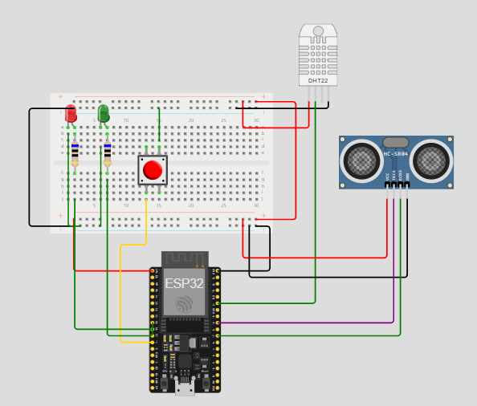
</a> 
Fonte: Material produzido pelos autores (2024)

&nbsp;&nbsp;&nbsp;&nbsp;A tabela a seguir apresenta uma descrição detalhada dos blocos funcionais do protótipo, especificando os componentes de entrada e saída, as condições de leitura e o comportamento esperado do sistema. O protótipo utiliza um sensor de temperatura DHT22 para monitorar as condições ambientais, LEDs para indicar estados do sistema e um botão de pressão para controle de liga/desliga. A interação entre esses componentes permite tanto a leitura precisa da temperatura quanto a sinalização de falhas, como a incapacidade de leitura, e condições críticas, como temperaturas elevadas. (Quadro 7).

Quadro 7 - Blocos funcionais do protótipo da Sprint 1   

**#** | **Bloco** | **Componente de entrada** | **Leitura da entrada** | **Componente de saída** | **Leitura da saída** | **Descrição**
|----------|----------|----------|----------|----------|----------|----------|
|01| Medidor de temperatura| Sensor de temperatura DHT22 | != NaN | Monitor serial | Temperatura atual em °C | Ao medir a temperatura, imprime no monitor serial o valor
|02| Medidor de temperatura| Sensor de temperatura DHT22 | == NaN | Monitor serial | Mensagem de Alerta | Ao tentar não conseguir ler a temperatura, emite uma mensagem de alerta
|03| Medidor de temperatura | Sensor de temperatura DHT22 | >= 50 | LED verde e LED vermelho | Piscantes em intervalo de 1s | Quando a temperatura atual passar de 50º C, os LEDs começam a piscar
|04| Medidor de temperatura | Sensor de temperatura DHT22 | < 50 | LED verde | Aceso | Em condições de temperatura ideal, permanece aceso
|05| Botão liga/desliga | Botão de Pressão | leitura == HIGH and ultimoEstado == LOW | LED verde | Aceso | Ao pressionar o botão com o sistema desligado, o LED acende, indicando que o sistema iniciou
|06| Botão liga/desliga | Botão de Pressão | leitura == LOW and ultimoEstado == HIGH | LED vermelho e monitor serial | Aceso e mensagem de alerta | Ao pressionar o botão com o sistema ligado, o LED acende, indicando que o sistema desligou, enquanto emite uma mensagem de alerta periodicamente
|07| Medidor de distância | Sensor ultrassônico | duration != 0 | Monitor serial | Distância em cm | Ao medir a distância, imprime no monitor serial o valor da distância medida em cm  
|08| Medidor de distância | Sensor ultrassônico | duration == 0 | Monitor serial | Mensagem de Alerta | Se a leitura falhar ou não detectar nada, exibe uma mensagem de erro

 
Fonte: Material produzido pelos autores (2024)

&nbsp;&nbsp;&nbsp;&nbsp;Em conclusão, o primeiro protótipo desenvolvido para o sistema de monitoramento IoT apresentou resultados promissores, validando as funcionalidades essenciais como a leitura de temperatura, o controle por botão e a sinalização de alertas por LEDs. A simulação realizada no Wokwi permitiu uma análise inicial da interação entre os componentes, facilitando a identificação de possíveis melhorias antes da implementação física. A partir disso, o próximo passo é o desenvolvimento do *hardware* físico.

### 3.4.2. Protótipo Físico do Projeto (_offline_)

&nbsp;&nbsp;&nbsp;&nbsp;A realização de testes físicos permite a melhor validação da eficácia do dispositivo IoT. Esses testes avaliam se os componentes e sensores estão funcionando conforme esperado e garantir que as interações de leitura e escrita entre o dispositivo e o ambiente aconteçam de maneira precisa e sem falhas.  Assegurar a coleta e o processamento corretos dos dados,que são críticos para tomadas de decisão, possibilitam a manutenção preventiva e aumento da vida útil do equipamento.

#### 3.4.2.1 Teste físico prensa

&nbsp;&nbsp;&nbsp;&nbsp; O teste físico do dispositivo IoT da prensa tem como objetivo servir como medida de verificação do bom funcionamento da solução desenvolvida. Os testes servem para que o usuário possa ter uma melhor compreenção de como dispositivo deve se comportar em cada uma de suas funcionalidades como notificar se o dispositivo está ligado e funcionando, se ele registra o tempo de uso de forma correta e por fim comunica e reinia o tempo da troca de óleo. (Quadro 8).

Quadro 8 - Testes físicos da prensa   

**#** | **Descrição** | **Pré-condição** | **Procedimento de teste** | **Pós-condição/Resultado esperado** | **Observações** | **Vídeo do Teste** | 
|----------|----------|----------|----------|----------|----------|------------|
|01|Verificação para checar se o dispositivo IoT está ligado.| O dispositivo está ligado na tomada.| Ligue o dispositivo IoT na tomada, aguarde alguns segundos e verifique se algum dos LEDs está acesso.| O LED verde deve acender se a prensa estiver ligada e o LED vermelho deve acender caso a prensa esteja desligada.| |[Link aqui](https://youtube.com/shorts/YFqT5zZgsZ4)
|02|Verificação do estado(Ligado/Desligado) corredo da prensa.|A prensa está se desligada e o dispositivo IoT está com o LED vermelho acesso.|Ligue e movimente a prensa.| Após movimentar a prensa para cima ou para baixo, em alguns segundos o LED verde deve acender indicando que a prensa está ligada.| Se a prensa permanecer imóvel por 5 minutos o LED vemelho deve acender.| [Link aqui](https://youtube.com/shorts/Ry0grD9ZtCk)
|03| Verificação para chechar se o dispositivo está registrando o tempo total que a máquina permaneceu ligada.|A prensa está ligada,o LED verde está acesso e o dispositivo IoT conectado a um computador para observar o serial print.| Movimente a prensa. |o computador deve registrar o serial print do tempo de uso total da máquina em segundos.| | [Link aqui](https://youtube.com/shorts/I4A5V3ld5l4)
|04|Verificação para checar se o dispositivo IoT notifica a troca de óleo. | Máquina ligada por 900 horas ou mais.| Utilize a prensa pelo tempo de no mínimo 900 horas.| Após o tempo de uso específicado o LED amarelo deve ficar acesso.| Se o dispositivo estiver conectado a um computador o serial Print também irá comunicar sobre a necessidade de troca de óleo.| [Link aqui](https://youtu.be/DoAhofVMEsQ)
|05| Verificação para checar se o dispositivo reinia o tempo de uso do óleo após o botão ser pressionado. | O LED amarelo deve estar ligado.| Verifique se o LED amarelo está ligado e pressione o Botão após trocar o óleo da máquina. | O LED amarelo deve apagar. | Após isso o tempo de 900 horas será reinicado. | [Link aqui](https://youtu.be/3EDGXAyfA_g)

 
Fonte: Material produzido pelos autores (2024)

&nbsp;&nbsp;&nbsp;&nbsp; Logo, ao utilizar esses testes que serão realizados no dispositivo IoT responsável por analisar a situação da prensa, o usuário poderá compreeder se a solução desenvolvida para prensa está em pleno funcionamento.

#### Dispositivo IoT para monitoramento do compressor

&nbsp;&nbsp;&nbsp;&nbsp;O dispositivo IoT desenvolvido para monitoramento do compressor é projetado para coletar e analisar dados em tempo real sobre a operação do equipamento. Ele utiliza sensores para medir vibração e temperatura, detectando variações que possam indicar possíveis problemas de desempenho ou riscos de falha. Através desses dados, é possível verificar o status de funcionamento do compressor, monitorar o tempo total de operação e detectar condições de hiperaquecimento. Esse monitoramento contínuo facilita a manutenção preventiva, reduzindo o risco de paradas não planejadas e prolongando a vida útil do compressor. Em caso de condições anômalas, o dispositivo emite alertas para que as ações corretivas sejam tomadas com rapidez e precisão.

#### 3.4.2.2 Teste físico compressor
&nbsp;&nbsp;&nbsp;&nbsp; O teste físico do dispositivo IoT do compressor tem como objetivo servir como medida de verificação do bom funcionamento da solução desenvolvida. Os testes servem para que o usuário possa ter uma melhor compreenção de como dispositivo deve se comportar em cada uma de suas funcionalidades como notificar se o dispositivo está ligado e funcionando, se ele registra o tempo de uso de forma correta e por fim comunica e a verificação de casos de hiperaquecimento. (Quadro 9).

Quadro 9 - Teste físico compressor   

**#** | **Descrição** | **Pré-condição** | **Procedimento de teste** | **Pós-condição/Resultado esperado** | **Observações**  | **Vídeo do Teste** |
|----------|----------|----------|----------|----------|----------|------------|  
|01| Verificação para checar se o dispositivo IoT inicializa corretamente.| Dispositivo IoT conectado à fonte de alimentação, inicializado e sensor de vibração configurado.| Conecte o dispositivo IoT, aguarde alguns segundos e verifique a reação dele conforme o estado de funcionamento do compressor.| O LED verde deve estar aceso se o compressor estiver ligado, enquanto nenhum LED deve estar aceso se o compressor estiver desligado |  | [Link aqui](https://youtu.be/EnKXOPZ-NhY)
|02| Verificação do sensor de vibração e leitura correta dos valores dos eixos X, Y e Z.| Dispositivo inicializado, sensor de vibração configurado e compressor funcionando.| Observe as leituras dos valores de X, Y, e Z no console serial.| Os valores dos eixos devem ser atualizados e exibidos no console serial.| É possível configurar o sensor de vibração para o intervalo de valores considerados, bem como para a sensibilidade dele. | [Link aqui](https://youtu.be/qhJirn91vfk)
|03| Verificação do tempo total que o compressor ficou ligado.| Dispositivo inicializado e com o sensor de vibração ativo (LED verde aceso).| Observe o tempo pelo qual o compressor esteve funcionando.| O console serial deve mostrar o tempo total do compressor ligado em milissegundos.| Este tempo deve somar o tempo acumulado de cada ciclo de ativação do compressor. | [Link aqui](https://youtu.be/9HxwbTIinsw)
|04| Verificação da leitura de temperatura pelo sensor.| Sensor de temperatura conectado e dispositivo inicializado.| Observe a saída do console serial para a leitura de temperatura. Certifique-se de que o ambiente tem uma temperatura previsível.| O console serial deve exibir a leitura da temperatura em graus Celsius, com valores condizentes com a temperatura ambiente.| Se o sensor falhar, o console deve exibir "Falha ao ler sensor BME280".  | [Link aqui](https://youtu.be/qGTB0sHXy0s)
|05| Verificação do alerta de hiperaquecimento.| Sensor de temperatura conectado e dispositivo inicializado.| Observe o aumento da temperatura da máquina ou ajuste o código para que a leitura exceda 50°C.| O console deve exibir "Máquina hiperaquecendo" quando a temperatura ultrapassar o limite de 50°C.| A mensagem deve ser exibida apenas quando a temperatura medida exceder 50°C. | [Link aqui](https://youtu.be/2kLWA772lSo)

 
Fonte: Material produzido pelos autores (2024)

&nbsp;&nbsp;&nbsp;&nbsp;_Os testes do compressor foram realizados no protótipo já soldado, diferentemente dos testes da prensa, por motivos de tempo em relação à entrega do artefado da sprint 4._

&nbsp;&nbsp;&nbsp;&nbsp;A construção e os testes do dispositivo IoT para monitoramento do compressor demonstraram sua eficácia em captar informações críticas para a manutenção preditiva do equipamento. Através da verificação dos sensores de vibração e temperatura, é possível validar se o dispositivo opera conforme o esperado, detectando tanto o tempo de funcionamento do compressor quanto as condições de hiperaquecimento que exigem atenção. Dessa forma, o dispositivo previne falhas inesperadas, mas também contribui para a longevidade do equipamento, otimizando a rotina de manutenção e aprimorando a eficiência operacional

### 3.4.3. Protótipo do Projeto com MQTT e I2C	
&nbsp;&nbsp;&nbsp;&nbsp; Nessa fase do projeto, o objetivo foi a finalização do protótipo físico e a conexão com uma interface por meio do protocolo MQTT (Message Queuing Telemetry Transport), um protocolo leve de comunicação projetado para dispositivos de baixo consumo e redes com largura de banda limitada que é amplamente utilizado para troca eficiente de mensagens entre dispositivos conectados. Isso tudo conectado a um broker MQTT que é o componente central de um sistema MQTT. Ele atua como um intermediário responsável por receber todas as mensagens de publicadores e encaminhá-las para os assinantes apropriados, ou seja, o broker o "núcleo" que conecta os dispositivos em uma rede IoT. 
&nbsp;&nbsp;&nbsp;&nbsp; Nesse projeto, foi utilizado o O Ubidots, uma plataforma de Internet das Coisas (IoT) baseada em nuvem que permite a coleta, análise, visualização e gerenciamento de dados provenientes de dispositivos conectados. Ele fornece ferramentas para criar dashboards, alertas e aplicativos para monitorar e interagir com dispositivos IoT. O Ubidots utiliza o protocolo MQTT para receber e enviar dados.O broker MQTT é integrado na infraestrutura do Ubidots e ao publicar ou assinar tópicos MQTT no Ubidots,o dispositivo está se conectando a um broker MQTT gerenciado pela própria plataforma. 
&nbsp;&nbsp;&nbsp;&nbsp; Na interface do Ubidots foram configurados dois deashboards, um para o dispositivo IoT da prensa e outro para o dispositivo do compressor, com o objetivo de melhorar a visuação dos dados coletados para cada máquina. As imagens dos protótipos físicos desenvolvidos estão abaixo, sendo possível observar a disposição dos elementos no protoboard.

#### Dispositivo IoT para monitoramento da prensa

&nbsp;&nbsp;&nbsp;&nbsp; O dispositivo abaixo permite ao usuário obeservar,por meio do display lcd,  o estado da prensa, se está ligada ou desligada, bem como o tempo de uso do óleo. (Figura 20).

Figura 20 - Protótipo físico IoT prensa  
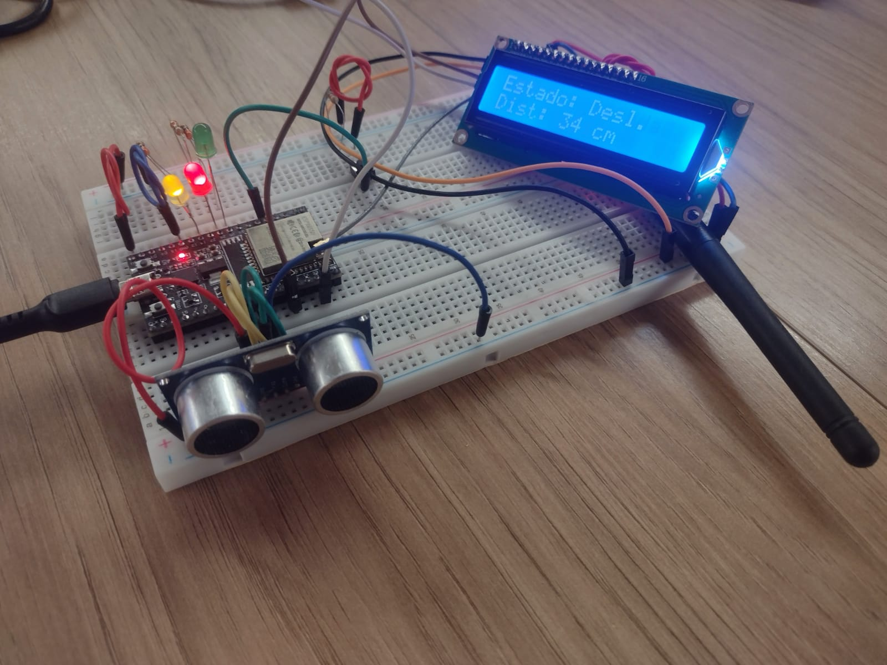
</a> 
Fonte: Material produzido pelos autores (2024)

**Dashboard prensa** 
&nbsp;&nbsp;&nbsp;&nbsp; O dashboard da prensa permite ao usuário compreender o estado no qual a prensa se encontra, sem precisar se deslocar até o local. Nele é possível observar se a máquina está ligada ou não, e se ele precisa realizar a troca de óleo ou não. O dashboard possibilita também registrar se o óleo foi trocado, resetando o tempo de uso. O dashboard conta também com um gráfico que registra a variação da distância da prensa ao longo do tempo. Conforme a figura 21 e quadro 10

Figura 21 - Dashboard prensa  
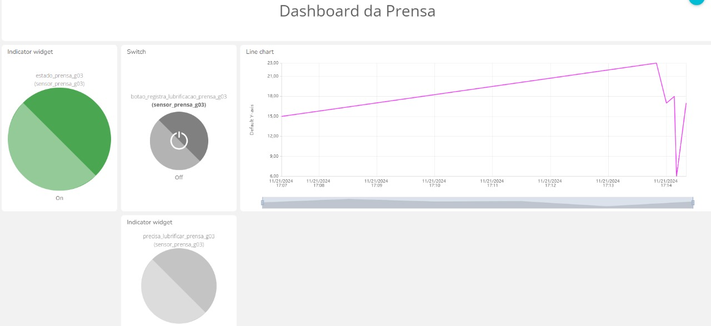
</a> 
Fonte: Material produzido pelos autores (2024)

Quadro 10 - Testes da prensa sprint 3   

**#** | **Configuração do ambiente** | **Ação do usuário** | **Resposta esperada do sistema** 
|----------|----------|----------|----------|
|01|O usuário precisa de um computador conectado na interface do ubidots e que o dispositivo da IoT da prensa está ligado a corretamente a prensa|O usuário acessa a interface e procura pelo estado da prensa| O dashboard deve apresensar um indicador em cor vermelha ou verde, simbolizando se a máquina está desligada ou ligada.  
|02|O usuário precisa de um computador conectado na interface do ubidots e que o dispositivo da IoT da prensa está ligado a corretamente a prensa|O usuário acessa a interface e checa se o há a necessidade de trocar o óleo| O dashboard deve apresensar um indicador em cor amarela se houver necessidade de troca de óleo e branco caso não houver. 
|03|O usuário precisa de um computador conectado na interface do ubidots e que o dispositivo da IoT da prensa está ligado a corretamente a prensa|O usuário acessa a interface após a troca de óleo ser realizada para resetar o tempo e clica no botão de registro de troca| O indicador de registro de troca de óleo deve sair da cor amarela e voltar para a cor branca.
|04|O usuário precisa de um computador conectado na interface do ubidots e que o dispositivo da IoT da prensa está ligado a corretamente a prensa|O usuário acessa a interface para checar a variação do da distância da prensa| O gráfico do dashboard deve apresentar a variação ao longo do tempo da distância da prensa na tela.****

 
Fonte: Material produzido pelos autores (2024)

#### Dispositivo IoT para monitoramento do compressor
&nbsp;&nbsp;&nbsp;&nbsp; O dispositivo IoT abaixo permite ao usuário observar, por meio do display lcd, a temperatura registrada pelo compressor, bem como o tempo de uso do óleo. (Figura 22).

Figura 22 - Protótipo físico IoT compressor  
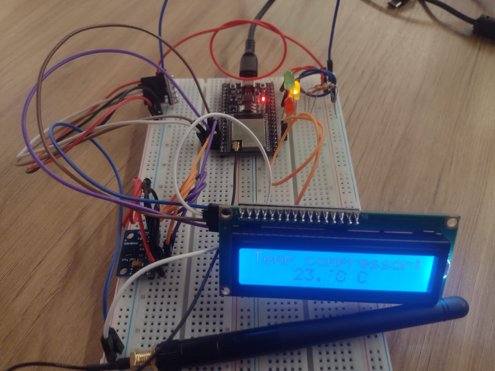
</a> 
Fonte: Material produzido pelos autores (2024)

**Dashboard Compressor**  
&nbsp;&nbsp;&nbsp;&nbsp;O dashboard do compressor permite ao usuário compreender o estado no qual a ele se encontra, sem precisar se deslocar até o local. Nele é possível observar se a máquina está ligada ou não e se ele precisa realizar a troca de óleo ou não. O dashboard possibilita também registrar se o óleo foi trocado, resetando o tempo de uso e possui um gráfico da variação da temperuatura ao longo do tempo. Conforme a figura 23 e quadro 11.

Figura 23 - Dashboard compressor  
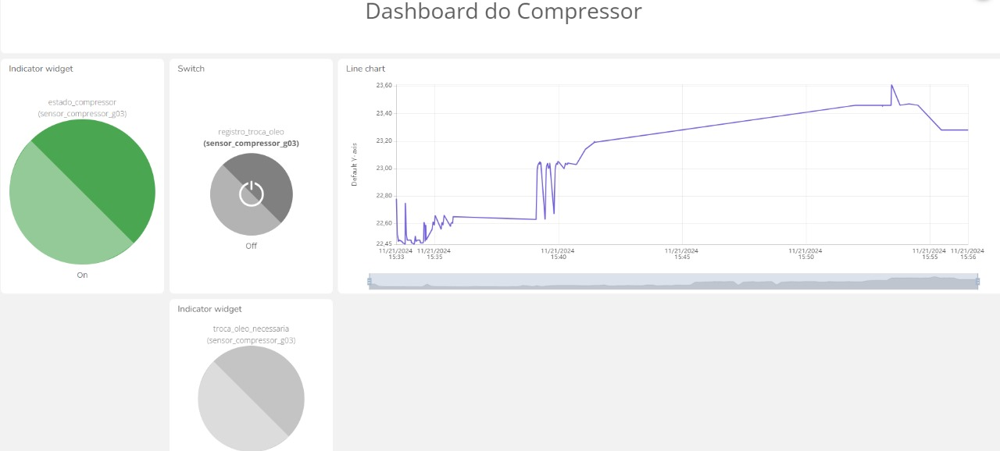
</a> 
Fonte: Material produzido pelos autores (2024)

Quadro 11 - Testes do compressor sprint 3   

**#** | **Configuração do ambiente** | **Ação do usuário** | **Resposta esperada do sistema** 
|----------|----------|----------|----------|
|01|O usuário precisa de um computador conectado na interface do ubidots e que o dispositivo da IoT do compressor está ligado a corretamente ao compressor |O usuário acessa a interface e procura pelo estado do compressor| O dashboard deve apresensar um indicador em cor vermelha ou verde, simbolizando se a máquina está desligada ou ligada.  
|02|O usuário precisa de um computador conectado na interface do ubidots e que o dispositivo da IoT do compressor está ligado a corretamente ao compressor|O usuário acessa a interface e checa se o há a necessidade de trocar o óleo| O dashboard deve apresensar um indicador em cor amarela se houver necessidade de troca de óleo e branco caso não houver. 
|03|O usuário precisa de um computador conectado na interface do ubidots e que o dispositivo da IoT do compressor está ligado a corretamente ao compressor|O usuário acessa a interface após a troca de óleo ser realizada para resetar o tempo e clica no botão de registro de troca| O indicador de registro de troca de óleo deve sair da cor amarela e voltar para a cor branca.
|04|O usuário precisa de um computador conectado na interface do ubidots e que o dispositivo da IoT do compressor está ligado a corretamente ao compressor|O usuário acessa a interface para checar a variação da temperatura do compressor| O gráfico do dashboard deve apresentar a variação da temperatura ao longo do tempo do compressor.|

 
Fonte: Material produzido pelos autores (2024)

&nbsp;&nbsp;&nbsp;&nbsp;A conclusão desta etapa representa um marco significativo no desenvolvimento do projeto, consolidando a integração entre hardware e software para monitoramento eficiente das máquinas. A implementação do protocolo MQTT garantiu uma comunicação ágil e confiável entre os dispositivos IoT e a plataforma Ubidots, permitindo a visualização detalhada dos dados em dashboards intuitivos e personalizados para cada máquina. O sucesso na configuração e operação dos protótipos físicos, aliados à funcionalidade dos dashboards, demonstra a viabilidade do sistema e sua aplicabilidade em cenários reais, estabelecendo uma base sólida para futuras expansões e aprimoramentos no monitoramento industrial.

### 3.4.4. Protótipo Físico do Projeto (online)

&nbsp;&nbsp;&nbsp;&nbsp;Nesta seção, serão apresentados os processos necessários para garantir que o comportamento do protótipo físico esteja em conformidade com os [casos de teste](#342-protótipo-físico-do-projeto-offline) previamente definidos. Para atingir esse objetivo, serão utilizados diagramas UML (_Unified Modeling Language_), uma linguagem de modelagem utilizada para representar, de forma clara e padronizada, os aspectos estruturais e comportamentais de um sistema. Cada diagrama é elaborado com base em um caso de teste específico, detalhando as interações entre os componentes do sistema e o fluxo de execução esperado. A inclusão de diagramas UML é essencial neste contexto, pois facilita a visualização e a validação dos requisitos funcionais, além de servir como um guia estruturado para a implementação e o diagnóstico de possíveis desvios de comportamento durante o desenvolvimento e os testes do protótipo.

#### 3.4.4.1. Procedimento de ligar o dispositivo IoT da prensa

&nbsp;&nbsp;&nbsp;&nbsp;O diagrama UML apresentado descreve a sequência de interações necessárias para o funcionamento do dispositivo IoT que monitora o estado da prensa utilizando um microcontrolador ESP32, sensor ultrassônico HC-SR04, LEDs indicativos e comunicação via protocolo MQTT. O fluxo detalha como os dados são coletados pelo sensor, processados pelo ESP32, sinalizados localmente com LEDs e enviados para uma plataforma remota (Ubidots) por meio de um broker MQTT. Este diagrama é uma ferramenta essencial para visualizar e entender o comportamento esperado do sistema, facilitando a validação do seu funcionamento em conformidade com os requisitos estabelecidos.(Figura 24)

Figura 24 - Diagrama UML: caso de teste 01 da prensa
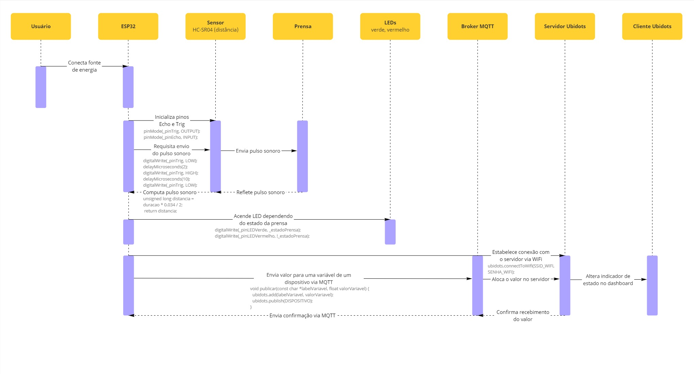
Fonte: Material produzido pelos autores (2024)

**Passos do Processo**

1. O usuário conecta a fonte de energia para inicializar o sistema.  
2. O ESP32 configura os pinos `Echo` e `Trig` do sensor ultrassônico como saída e entrada, respectivamente.  
3. O ESP32 solicita ao sensor ultrassônico o envio de um pulso sonoro.  
4. O sensor ultrassônico emite o pulso sonoro e aguarda o reflexo.  
5. O sensor retorna o tempo de duração do pulso refletido, e o ESP32 calcula a distância com base nesse valor.  
6. O ESP32 aciona o LED verde ou vermelho dependendo do estado da prensa (operacional ou inativo).  
7. O valor medido é enviado para o broker MQTT através da função de publicação implementada no ESP32.  
8. O broker MQTT encaminha os dados para o servidor Ubidots.  
9. O ESP32 estabelece uma conexão com o servidor Ubidots utilizando a rede Wi-Fi configurada.  
10. O servidor Ubidots recebe e registra o valor enviado, atualizando o estado correspondente no dashboard.  
11. O cliente Ubidots exibe o indicador de estado no painel remoto e confirma o recebimento do valor enviado.

&nbsp;&nbsp;&nbsp;&nbsp;O diagrama apresentado oferece uma visão clara e detalhada das interações entre os componentes do sistema IoT, desde a coleta de dados pelo sensor até a atualização do estado no _dashboard_ remoto. Essa representação permite identificar potenciais falhas no fluxo, além de fornecer uma base sólida para a implementação e o teste do sistema. O uso combinado do sensor ultrassônico, LEDs indicativos e comunicação MQTT demonstra como a integração eficiente de _hardware_ e _software_ pode atender aos requisitos funcionais do projeto de forma robusta e confiável.

#### 3.4.4.2. Procedimento de verificar estado da prensa

&nbsp;&nbsp;&nbsp;&nbsp;O diagrama UML apresentado ilustra o fluxo de interações necessárias para registrar o estado da prensa enquanto está em operação. Nesse cenário, o sistema coleta dados da redução de distância medida pelo sensor ultrassônico em resposta ao movimento da máquina, processa essas informações no ESP32 e sinaliza o estado por meio de LEDs. Em seguida, o valor calculado é enviado via protocolo MQTT para o servidor Ubidots, onde é registrado e exibido no dashboard remoto. Esse fluxo automatizado assegura a coleta precisa de dados e a comunicação eficiente entre o hardware e a interface de monitoramento, essencial para acompanhar o funcionamento da prensa em tempo real. (Figura 25).

Figura 25 - Diagrama UML: caso de teste 02 da prensa
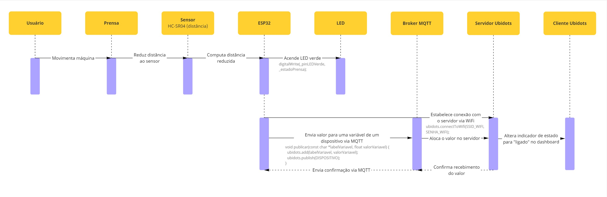
Fonte: Material produzido pelos autores (2024)

**Passos do Processo**

1. O usuário movimenta a máquina, acionando o funcionamento da prensa.  
2. A distância entre a prensa e o sensor ultrassônico é reduzida devido ao movimento da máquina.  
3. O sensor ultrassônico detecta a redução da distância e envia a medição para o ESP32.  
4. O ESP32 computa o valor da distância reduzida e determina o estado atual da prensa.  
5. O ESP32 acende o LED verde para indicar o estado operacional normal da prensa.  
6. O valor medido é publicado pelo ESP32 em uma variável no broker MQTT, utilizando a função de envio.  
7. O broker MQTT encaminha o valor para o servidor Ubidots.  
8. O servidor Ubidots estabelece a conexão com a rede Wi-Fi, registra o valor recebido e o aloca em seu sistema.  
9. O dashboard do cliente Ubidots atualiza o indicador de estado, exibindo "ligado".  
10. O servidor confirma o recebimento do valor enviado via MQTT.

&nbsp;&nbsp;&nbsp;&nbsp;O diagrama ilustra a sinergia entre os componentes do sistema para monitorar o funcionamento da prensa em tempo real. A integração de sensores, LEDs e comunicação MQTT proporciona uma solução robusta e eficiente, garantindo que os dados coletados sejam processados e disponibilizados no dashboard remoto de maneira confiável. Essa abordagem não só melhora a visibilidade do estado da máquina, mas também contribui para a manutenção preditiva e o acompanhamento contínuo do desempenho.

#### 3.4.4.3. Procedimento de verificar o tempo total em que a prensa permaneceu ligada

&nbsp;&nbsp;&nbsp;&nbsp;O diagrama a seugir descreve o processo de monitoramento do tempo de uso do óleo em uma máquina com base na interação entre o sensor de distância, o ESP32, um display LCD e o servidor Ubidots. O sistema utiliza o sensor ultrassônico para registrar o funcionamento da prensa e iniciar um cronômetro. Os dados do tempo acumulado são exibidos no display e enviados para o servidor via MQTT, onde são atualizados no dashboard. Quando a máquina para de operar, o sistema interrompe o cronômetro e mantém o tempo registrado. (Figura 26).

Figura 26 - Diagrama UML: caso de teste 03 da prensa
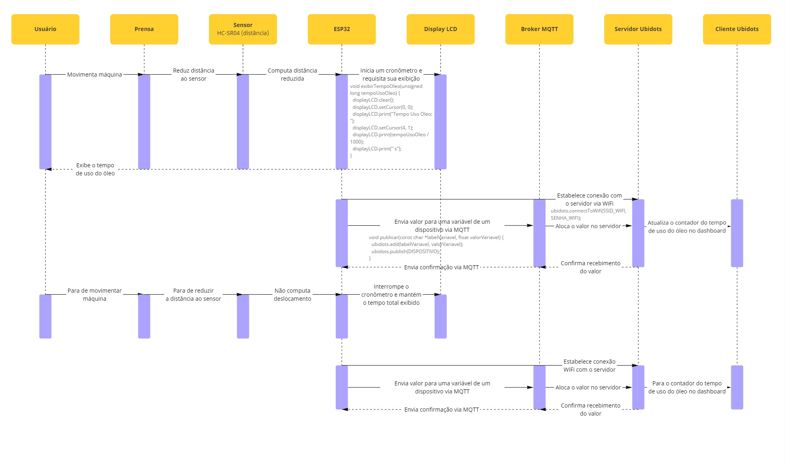
Fonte: Material produzido pelos autores (2024)

**Passos do Processo**

1. O usuário movimenta a máquina, acionando o funcionamento da prensa.  
2. A distância entre a prensa e o sensor ultrassônico é reduzida devido ao movimento da máquina.  
3. O sensor detecta a distância reduzida e envia o valor para o ESP32.  
4. O ESP32 computa a distância reduzida e determina que a máquina está operando.  
5. O ESP32 inicia o cronômetro e solicita a exibição do tempo de uso do óleo no display LCD.  
6. O tempo de uso acumulado é exibido no display LCD de forma contínua.  
7. O ESP32 publica o valor do tempo acumulado em uma variável no broker MQTT.  
8. O broker MQTT encaminha os dados para o servidor Ubidots.  
9. O servidor Ubidots estabelece a conexão com a rede Wi-Fi, aloca o valor recebido e o registra em seu sistema.  
10. O dashboard do cliente Ubidots atualiza o contador do tempo de uso do óleo.  
11. Quando o usuário para de movimentar a máquina, o sensor ultrassônico deixa de detectar a redução de distância.  
12. O ESP32 interrompe o cronômetro e mantém o último valor do tempo exibido no display LCD.  
13. O ESP32 publica o valor final do tempo na variável do broker MQTT.  
14. O broker MQTT encaminha o valor final para o servidor Ubidots.  
15. O servidor confirma o recebimento do valor e registra o estado final no dashboard.

&nbsp;&nbsp;&nbsp;&nbsp;Este diagrama demonstra o fluxo de trabalho de um sistema que monitora o tempo de uso do óleo em máquinas industriais, integrando hardware e software para fornecer dados precisos e em tempo real. A combinação do sensor de distância, do display LCD e da comunicação via MQTT permite uma coleta eficiente de informações e sua visualização no dashboard. A capacidade de registrar o tempo acumulado mesmo após a parada da máquina garante a integridade dos dados, oferecendo suporte valioso para a manutenção preditiva e a gestão de recursos.

#### 3.4.4.4. Procedimento de verificar notificação da troca de óleo

&nbsp;&nbsp;&nbsp;&nbsp;O diagrama UML descreve o processo de monitoramento do tempo de uso de uma máquina industrial utilizando um sensor ultrassônico, um microcontrolador ESP32, e integração com o servidor Ubidots via protocolo MQTT. Ele detalha as interações entre os componentes do sistema, desde a detecção do tempo de operação até a notificação no dashboard do cliente sobre a necessidade de manutenção. (Figura 27).

Figura 27 - Diagrama UML: caso de teste 04 da prensa
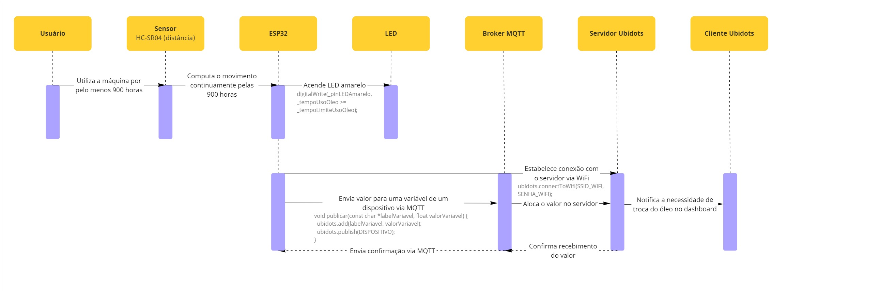
Fonte: Material produzido pelos autores (2024)

**Passos do Processo**

1. O usuário utiliza a máquina, acumulando um tempo de uso superior a 900 horas.  
2. O sensor HC-SR04 detecta e computa o movimento da máquina continuamente pelas 900 horas acumuladas.  
3. O ESP32 acende um LED amarelo para sinalizar que o limite de uso foi atingido.  
4. O ESP32 envia o valor do tempo acumulado para uma variável do Ubidots via protocolo MQTT.  
5. O broker MQTT recebe o valor e o encaminha para o servidor Ubidots.  
6. O servidor Ubidots estabelece conexão via WiFi, aloca o valor recebido e o registra no sistema.  
7. O servidor Ubidots notifica o cliente sobre a necessidade de manutenção, atualizando o dashboard.  
8. O broker MQTT confirma o recebimento dos dados ao ESP32.

&nbsp;&nbsp;&nbsp;&nbsp;O diagrama apresenta um sistema automatizado eficiente que monitora o tempo de uso da máquina, sinaliza a necessidade de manutenção localmente com um LED e envia os dados para a nuvem. A integração entre os dispositivos IoT e o servidor Ubidots garante a rastreabilidade do tempo de operação e uma interface amigável para o cliente no dashboard.

#### 3.4.4.5. Procedimento de ativar o botão de troca de óleo

&nbsp;&nbsp;&nbsp;&nbsp;O diagrama detalha o processo de reinicialização do monitoramento do tempo de uso de uma máquina industrial após a troca do óleo. Ele descreve as interações entre os componentes, desde o acionamento manual pelo usuário até a atualização no servidor Ubidots, indicando que a manutenção foi realizada. (Figura 28).

Figura 28 - Diagrama UML: caso de teste 05 da prensa
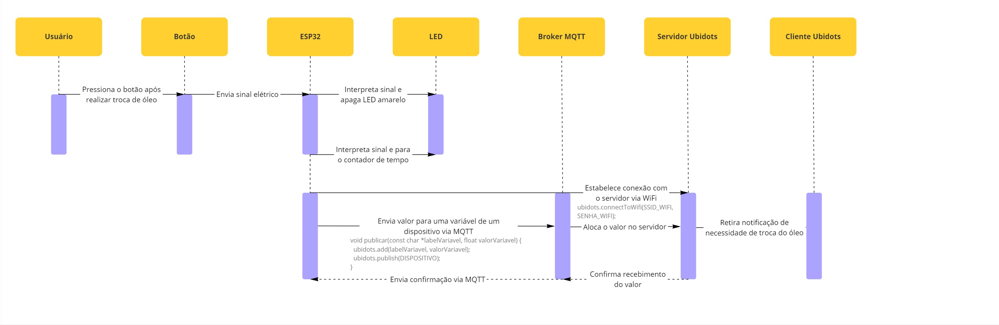
Fonte: Material produzido pelos autores (2024)

**Passos do Processo**

1. O usuário pressiona o botão após realizar a troca do óleo.  
2. O botão envia um sinal elétrico para o ESP32.  
3. O ESP32 interpreta o sinal e apaga o LED amarelo, indicando que o limite de uso foi redefinido.  
4. O ESP32 interrompe o contador de tempo e reinicia o processo de monitoramento.  
5. O ESP32 publica o novo valor da variável no broker MQTT.  
6. O broker MQTT encaminha o valor para o servidor Ubidots.  
7. O servidor Ubidots estabelece conexão com a rede WiFi, aloca o valor recebido e registra a alteração no sistema.  
8. O servidor Ubidots remove a notificação de necessidade de troca de óleo no dashboard do cliente.  
9. O broker MQTT confirma o recebimento do novo estado ao ESP32.

&nbsp;&nbsp;&nbsp;&nbsp;Este diagrama demonstra a funcionalidade de redefinição do sistema após a manutenção, garantindo que o monitoramento seja retomado com novos parâmetros e que as notificações no dashboard reflitam o estado atualizado da máquina.

#### 3.4.4.6. Procedimento de ligar o dispositivo IoT do compressor

&nbsp;&nbsp;&nbsp;&nbsp;Este diagrama descreve o processo de monitoramento das condições de operação de um compressor utilizando sensores conectados a um ESP32. Ele detalha as interações desde a inicialização do sistema até a atualização do estado no dashboard do cliente Ubidots. (Figura 29).

Figura 29 - Diagrama UML: caso de teste 01 do compressor
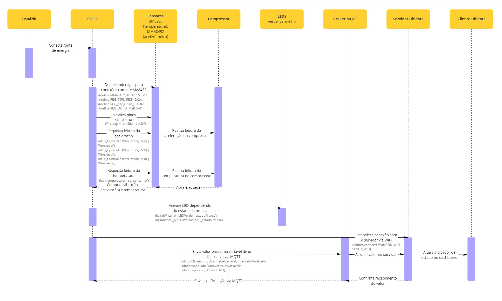
Fonte: Material produzido pelos autores (2024)

**Passos do Processo**

1. O usuário conecta a fonte de energia ao sistema.  
2. O ESP32 define os endereços para conexão com o sensor acelerômetro MMA8452.  
3. O ESP32 inicializa os pinos de comunicação I2C (SCL e SDA) para leitura dos sensores.  
4. O ESP32 solicita a leitura da aceleração do compressor ao sensor MMA8452.  
5. O ESP32 solicita a leitura da temperatura do compressor ao sensor BME280.  
6. O ESP32 computa os dados de vibração (aceleração) e temperatura do compressor.  
7. O ESP32 acende o LED verde ou vermelho dependendo do estado do compressor:  
   - Verde: compressor está dentro dos parâmetros normais de operação.  
   - Vermelho: compressor fora dos parâmetros ideais (superaquecimento ou vibração excessiva).  
8. O ESP32 publica o estado do compressor (temperatura e vibração) no broker MQTT.  
9. O broker MQTT encaminha os dados ao servidor Ubidots.  
10. O servidor Ubidots estabelece conexão via WiFi, aloca os dados recebidos e registra o estado do compressor no sistema.  
11. O cliente Ubidots atualiza o dashboard, exibindo o estado atualizado do compressor.  
12. O broker MQTT confirma o recebimento do valor ao ESP32.

&nbsp;&nbsp;&nbsp;&nbsp;Este diagrama ilustra o fluxo de informações no monitoramento do compressor, destacando o papel do ESP32 na leitura dos sensores e comunicação com o broker MQTT e o servidor Ubidots. Essa integração permite um acompanhamento em tempo real das condições de operação do equipamento.

#### 3.4.4.7. Procedimento de verificar a leitura da vibração pelo dispositivo IoT

&nbsp;&nbsp;&nbsp;&nbsp;O diagrama descreve um fluxo simplificado que detalha a interação entre o compressor, o sensor de aceleração MMA8452 e o ESP32. Ele ilustra a captura e o processamento de dados de vibração em um cenário de teste básico. (Figura 30).

Figura 30 - Diagrama UML: caso de teste 02 do compressor
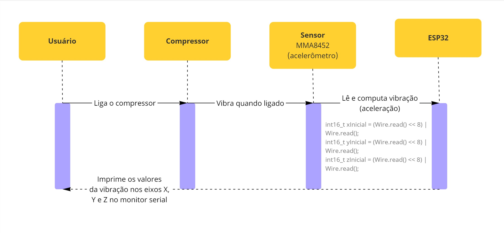
Fonte: Material produzido pelos autores (2024)

**Passos do Processo**

1. O usuário liga o compressor manualmente.
2. O compressor gera vibração enquanto está ativo.
3. O sensor MMA8452 mede os valores de aceleração nos eixos X, Y e Z.
4. O ESP32 processa os dados lidos do sensor e exibe os valores de aceleração no monitor serial.

&nbsp;&nbsp;&nbsp;&nbsp;Este diagrama é ideal para validar o funcionamento do sensor de aceleração e do ESP32 em um ambiente controlado. Ele fornece uma base sólida para depuração e ajustes antes da integração com outros componentes do sistema.

#### 3.4.4.8. Procedimento de verificar o tempo total em que o compressor permaneceu ligado

&nbsp;&nbsp;&nbsp;&nbsp;O diagrama que segue detalha o ciclo operacional de um sistema IoT aplicado ao monitoramento de um compressor. Ele ilustra como o tempo de uso do óleo é monitorado e exibido em um display LCD, além de como os dados são transmitidos via MQTT para o servidor Ubidots. O fluxo de trabalho abrange desde a inicialização do compressor até a interrupção do monitoramento ao desligá-lo. (Figura 31).

**Passos do Processo**

Figura 31 - Diagrama UML: caso de teste 03 do compressor
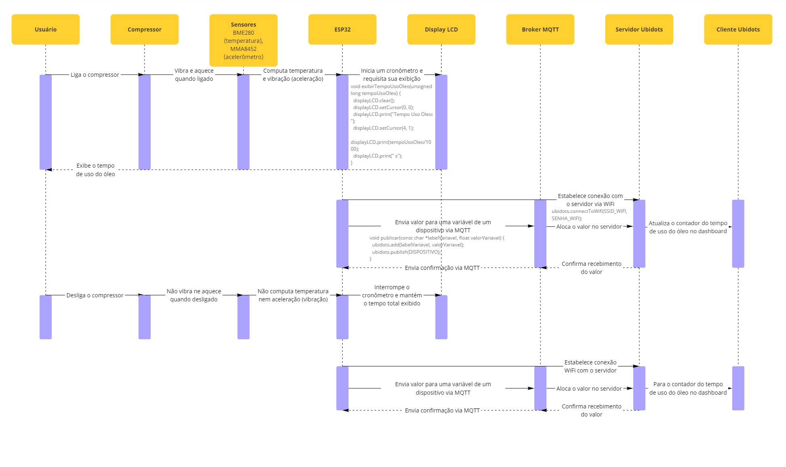
Fonte: Material produzido pelos autores (2024)

1. O usuário liga o compressor.
2. O compressor começa a vibrar e aquecer quando ativado.
3. O sensor MMA8452 computa a vibração (aceleração).
4. O sensor BME280 computa a temperatura.
5. O ESP32 inicia um cronômetro e requisita a exibição do tempo de uso do óleo no display LCD.
6. O ESP32 exibe o tempo de uso do óleo no display LCD.
7. O ESP32 publica o valor do tempo de uso do óleo via MQTT.
8. O broker MQTT recebe o valor enviado pelo ESP32.
9. O servidor Ubidots estabelece conexão via WiFi e aloca o valor recebido no sistema.
10. O cliente Ubidots atualiza o dashboard com o tempo de uso do óleo exibido.
11. O usuário desliga o compressor.
12. O compressor para de vibrar e aquecer.
13. O ESP32 interrompe o cronômetro e mantém o tempo total exibido no display LCD.
14. O ESP32 envia novamente o valor final acumulado via MQTT.
15. O broker MQTT confirma o recebimento dos dados.
16. O servidor Ubidots registra o valor final e para o contador no dashboard do cliente.

&nbsp;&nbsp;&nbsp;&nbsp;Esse diagrama demonstra como um sistema IoT pode gerenciar e monitorar variáveis operacionais críticas de um compressor, integrando sensores, um microcontrolador e a nuvem para oferecer uma solução automatizada e acessível. Este processo assegura que os dados sejam registrados e exibidos para facilitar decisões baseadas em métricas confiáveis.

#### 3.4.4.9. Procedimento de verificar a leitura da temperatura pelo dispositivo IoT

&nbsp;&nbsp;&nbsp;&nbsp;Este diagrama descreve o processo de monitoramento da temperatura de um compressor usando um sensor BME280 e um ESP32. Ele ilustra as interações desde a inicialização do sistema até a exibição da temperatura no display LCD e sua atualização em um dashboard conectado ao servidor Ubidots. (Figura 32).

Figura 32 - Diagrama UML: caso de teste 04 do compressor
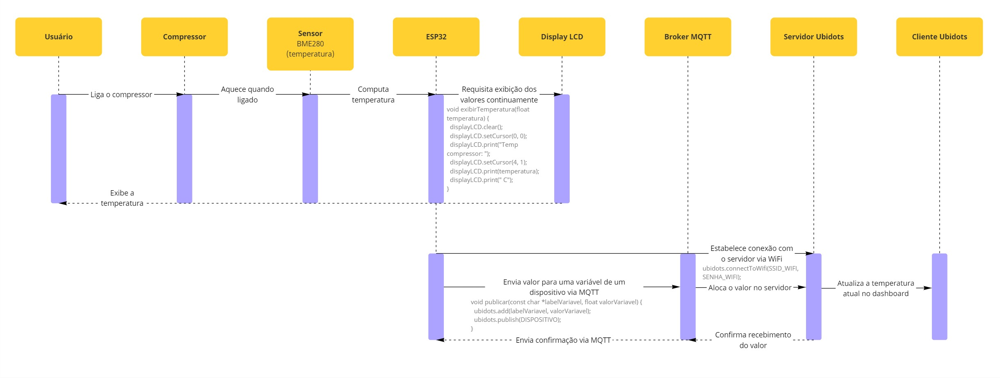
Fonte: Material produzido pelos autores (2024)

**Passos do Processo**

1. O usuário liga o compressor, iniciando o processo.  
2. O compressor aquece enquanto está em operação.  
3. O sensor BME280 calcula a temperatura atual do compressor.  
4. O ESP32 solicita a exibição contínua da temperatura ao display LCD:  
   - Limpa o display.  
   - Posiciona o cursor e exibe a mensagem "Temp compressor".  
   - Apresenta a temperatura medida seguida de "°C".  
5. O ESP32 publica o valor da temperatura em uma variável usando o protocolo MQTT.  
6. O broker MQTT encaminha os dados para o servidor Ubidots.  
7. O servidor Ubidots estabelece conexão via WiFi e aloca o valor recebido na variável associada ao dispositivo.  
8. O cliente Ubidots atualiza o dashboard com a temperatura atualizada do compressor.  
9. O broker MQTT confirma o recebimento do valor ao ESP32.

&nbsp;&nbsp;&nbsp;&nbsp;Este diagrama destaca como o ESP32 gerencia a coleta e exibição de dados, conectando diferentes dispositivos e plataformas para fornecer monitoramento em tempo real e centralizado da temperatura do compressor.

#### 3.4.4.10. Procedimento de verificar a notificação de superaquecimento do compressor

&nbsp;&nbsp;&nbsp;&nbsp;Este diagrama descreve o processo de monitoramento e alerta de superaquecimento de um compressor. Ele demonstra as interações entre os componentes, como o sensor BME280, ESP32, LED, buzzer e o servidor Ubidots, para monitorar a temperatura, emitir alertas locais e atualizar dados em um dashboard remoto. (Figura 33).

Figura 33 - Diagrama UML: caso de teste 05 do compressor
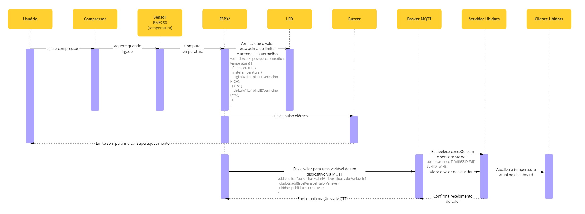
Fonte: Material produzido pelos autores (2024)

**Passos do Processo**

1. O usuário liga o compressor.  
2. O compressor aquece durante a operação.  
3. O sensor BME280 calcula a temperatura do compressor.  
4. O ESP32 verifica se a temperatura excede o limite configurado:  
   - Caso a temperatura esteja acima do limite, o ESP32 acende o LED vermelho para indicar superaquecimento.  
   - Caso contrário, o LED vermelho permanece apagado.  
5. O ESP32 envia um pulso elétrico para o buzzer, emitindo um som de alerta em caso de superaquecimento.  
6. O ESP32 publica a temperatura registrada em uma variável usando o protocolo MQTT.  
7. O broker MQTT transmite os dados para o servidor Ubidots.  
8. O servidor Ubidots estabelece conexão via WiFi e armazena o valor recebido na variável associada ao dispositivo.  
9. O cliente Ubidots atualiza o dashboard, exibindo a temperatura atualizada do compressor.  
10. O broker MQTT confirma o recebimento do valor ao ESP32.

&nbsp;&nbsp;&nbsp;&nbsp;Este diagrama ressalta a funcionalidade de alerta local combinada com o monitoramento remoto. Ele integra sensores e sistemas de comunicação para garantir uma resposta rápida em caso de falhas operacionais, como superaquecimento do compressor.

&nbsp;&nbsp;&nbsp;&nbsp;Concluindo, essa seção demonstrou, por meio de diagramas UML e procedimentos detalhados, uma visão clara do funcionamento do protótipo físico, evidenciando a integração entre sensores, comunicação com o servidor e exibição de dados no _dashboard_. Esses modelos não apenas asseguram a validação funcional do sistema, mas também facilitam ajustes durante o desenvolvimento, garantindo que o projeto atenda aos requisitos propostos com eficiência e confiabilidade.

### 3.4.5. Protótipo Final do Projeto

&nbsp;&nbsp;&nbsp;&nbsp;Nesta seção, serão apresentados os processos relacionados às interações com os protótipos finais, baseados nos [casos de teste](#342-protótipo-físico-do-projeto-offline). Esses processos representam as funcionalidades principais e as ações disponíveis para cada tipo de máquina monitorada, sendo ilustrados por meio de diagramas UML específicos para cada atividade. Além disso, será feita uma demonstração prática de cada processo descrito, utilizando vídeos que mostram o funcionamento real dos dispositivos no contexto simulado de monitoramento das máquinas prensa e compressor de ar.

#### 3.4.5.1 Protótipo Final do Dispositivo de Monitoramento da Prensa

&nbsp;&nbsp;&nbsp;&nbsp;Nesta subseção, são descritos os processos associados ao dispositivo IoT desenvolvido para o monitoramento da prensa. Cada funcionalidade foi elaborada com base em situações práticas que ocorrem no uso diário da máquina, de forma que o dispositivo atenda às necessidades de supervisão e manutenção. Os processos foram documentados em uma tabela que relaciona os casos de teste, os respectivos diagramas UML e vídeos de demonstração que exemplificam o funcionamento do sistema na prática.  

| **Caso de teste**                                                                                         | **Diagrama UML**                                                                                  | **Vídeo de demonstração**                                                                     |
|-----------------------------------------------------------------------------------------------------------|---------------------------------------------------------------------------------------------------|-----------------------------------------------------------------------------------------------|
| Verificação para checar se o dispositivo IoT está ligado.                                                 | [Diagrama UML 1](#3441-procedimento-de-ligar-o-dispositivo-iot-da-prensa)                         | [Link do vídeo de demonstração 1](https://youtube.com/shorts/YFqT5zZgsZ4?si=Gu-ba4nfzZ0rPpqI) |
| Verificação do estado(Ligado/Desligado) corredo da prensa.                                                | [Diagrama UML 2](#3442-procedimento-de-verificar-estado-da-prensa)                                | [Link do vídeo de demonstração 2](https://youtube.com/shorts/Ry0grD9ZtCk?si=pUX1vCld-DvQNNu8) |
| Verificação para chechar se o dispositivo está registrando o tempo total que a máquina permaneceu ligada. | [Diagrama UML 3](#3443-procedimento-de-verificar-o-tempo-total-em-que-a-prensa-permaneceu-ligada) | [Link do vídeo de demonstração 3](https://youtube.com/shorts/I4A5V3ld5l4?si=ML38ZTi_dBOkHUbY) |
| Verificação para checar se o dispositivo IoT notifica a troca de óleo.                                    | [Diagrama UML 4](#3444-procedimento-de-verificar-notificação-da-troca-de-óleo)                    | [Link do vídeo de demonstração 4](https://youtu.be/DoAhofVMEsQ?si=QSWPuzV4zbN2Uo4T)           |
| Verificação para checar se o dispositivo reinia o tempo de uso do óleo após o botão ser pressionado.      | [Diagrama UML 5](#3445-procedimento-de-ativar-o-botão-de-troca-de-óleo)                           | [Link do vídeo de demonstração 5](https://youtu.be/3EDGXAyfA_g?si=XnV3ld27vRz1dU6k)           |

&nbsp;&nbsp;&nbsp;&nbsp;Os processos descritos abrangem funcionalidades do monitoramento da prensa. O primeiro caso verifica se o dispositivo IoT está ligado, garantindo que o monitoramento possa ser iniciado. Em seguida, há um processo para checar o estado de funcionamento da prensa (ligada ou desligada), permitindo que o operador acompanhe o status em tempo real. Outra funcionalidade importante é a verificação do tempo total que a prensa permaneceu ligada, fornecendo métricas úteis para avaliação do uso e planejamento de manutenções. Além disso, o dispositivo IoT é capaz de notificar o operador tanto por meio do _dashboard_ Ubidots quanto por meio de serviço SMS sobre a necessidade de troca de óleo, com base no tempo de uso acumulado. Essa funcionalidade tem o objetivo de prolongar a vida útil do equipamento e manter sua eficiência. Por fim, há um processo para reiniciar o tempo de uso do óleo após a realização da troca, por meio de um botão específico também localizado no _dashboard_.(Figura 34)

Figura 34 - Protótipo Final Dispositivo Prensa
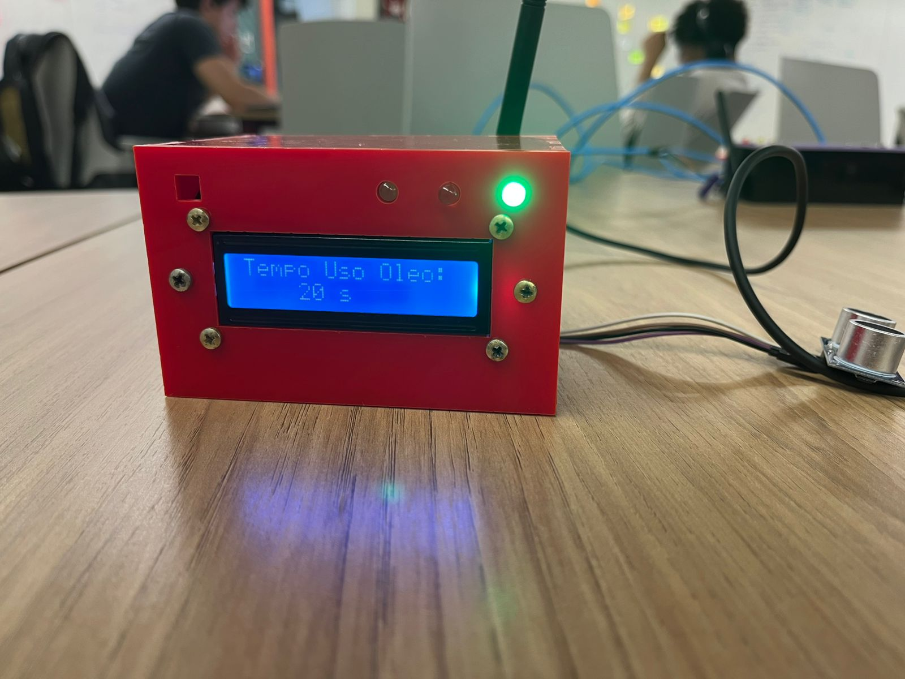
Fonte: Material produzido pelos autores (2024)

&nbsp;&nbsp;&nbsp;&nbsp;A tabela apresentada reúne os principais processos relacionados ao dispositivo IoT da prensa, proporcionando uma visão clara a respeito das funcionalidades implementadas. Os diagramas UML e vídeos de demonstração complementam a documentação, permitindo uma compreensão detalhada do funcionamento de cada processo.

#### 3.4.5.2 Protótipo Final do Dispositivo de Monitoramento do Compressor

&nbsp;&nbsp;&nbsp;&nbsp;Nesta subseção, são descritos os processos associados ao dispositivo IoT desenvolvido para o monitoramento do compressor de ar. Cada funcionalidade foi projetada para atender a situações práticas de uso, de modo que o dispositivo auxilie na supervisão e manutenção do equipamento. Os processos estão organizados em uma tabela que relaciona os casos de teste, os respectivos diagramas UML e vídeos de demonstração, permitindo uma compreensão nítida e detalhada de cada atividade.

| **Caso de teste**                                                                   | **Diagrama UML**                                                                                      | **Vídeo de demonstração**                                                            |
|-------------------------------------------------------------------------------------|-------------------------------------------------------------------------------------------------------|--------------------------------------------------------------------------------------|
| Verificação para checar se o dispositivo IoT inicializa corretamente.               | [Diagrama UML 1](#3446-procedimento-de-ligar-o-dispositivo-iot-do-compressor)                         | [Link do vídeo de demonstração 6](https://youtu.be/EnKXOPZ-NhY?si=L-LiiF01qOiO2JEM)  |
| Verificação do sensor de vibração e leitura correta dos valores dos eixos X, Y e Z. | [Diagrama UML 2](#3447-procedimento-de-verificar-a-leitura-da-vibração-pelo-dispositivo-iot)          | [Link do vídeo de demonstração 7](https://youtu.be/qhJirn91vfk?si=G8zrkNpMCvcws3_t)  |
| Verificação do tempo total que o compressor ficou ligado.                           | [Diagrama UML 3](#3448-procedimento-de-verificar-o-tempo-total-em-que-o-compressor-permaneceu-ligado) | [Link do vídeo de demonstração 8](https://youtu.be/9HxwbTIinsw?si=tT2YU0j_F3e5k-dg)  |
| Verificação da leitura de temperatura pelo sensor.                                  | [Diagrama UML 4](#3449-procedimento-de-verificar-a-leitura-da-temperatura-pelo-dispositivo-iot)       | [Link do vídeo de demonstração 9](https://youtu.be/qGTB0sHXy0s?si=1Lhi6yEzzFWuPHqr)  |
| Verificação do alerta de hiperaquecimento.                                          | [Diagrama UML 5](#34410-procedimento-de-verificar-a-notificação-de-superaquecimento-do-compressor)    | [Link do vídeo de demonstração 10](https://youtu.be/2kLWA772lSo?si=ybXXYH5o7UWlpgxx) |

&nbsp;&nbsp;&nbsp;&nbsp;Os processos documentados abrangem funcionalidades necessárias ao monitoramento do compressor de ar. O primeiro caso verifica se o dispositivo IoT inicializa corretamente, assegurando que o sistema está pronto para operação. Em seguida, há uma funcionalidade que avalia o sensor de vibração, registrando leituras precisas dos valores nos eixos X, Y e Z, o que é fundamental para monitorar o desempenho do compressor. Outra funcionalidade destacada é a verificação do tempo total que o compressor permaneceu ligado, proporcionando métricas úteis para o gerenciamento de uso. Além disso, o dispositivo inclui um sensor de temperatura para monitorar variações térmicas, permitindo a identificação de possíveis anomalias. Complementando esse recurso, há um sistema de alerta de hiperaquecimento que notifica o operador tanto via _dashboard_ Ubidots quanto via serviço SMS sempre que a temperatura ultrapassa limites seguros, evitando danos ao equipamento. Esses processos foram desenvolvidos para oferecer um monitoramento eficiente e integrado, alinhado às necessidades operacionais do compressor de ar.(Figura 35)

Figura 35 - Protótipo Final Dispositivo Compressor

Fonte: Material produzido pelos autores (2024)

&nbsp;&nbsp;&nbsp;&nbsp;A tabela apresentada resume os processos essenciais do dispositivo IoT para o compressor de ar, destacando as principais funcionalidades e suas aplicações práticas. Os diagramas UML e vídeos de demonstração fornecem suporte visual e prático à documentação, facilitando a compreensão detalhada do sistema e reforçando sua eficiência no monitoramento e manutenção do equipamento.

&nbsp;&nbsp;&nbsp;&nbsp;Com a documentação detalhada dos processos associados aos protótipos finais dos dispositivos IoT para a prensa e o compressor de ar, é possível demonstrar a funcionalidade de cada sistema. A integração entre casos de teste, diagramas UML e vídeos de demonstração permite uma visão abrangente das capacidades implementadas, destacando a eficácia das soluções propostas para atender às necessidades de monitoramento e manutenção das máquinas. Nesse sentido, é possível observar a aplicabilidade prática dos dispositivos, o que proporciona um suporte importante para futuras implementações e aprimoramentos tecnológicos no contexto da supervisão industrial inteligente.

### 3.4.6. Testes de Usabilidade 

### 3.4.6. Testes de Usabilidade

&nbsp;&nbsp;&nbsp;&nbsp;Os testes de usabilidade foram realizados no Inteli, localizado em São Paulo, SP, no dia 2 de dezembro de 2024. O objetivo principal foi validar a funcionalidade da aplicação IoT destinada ao monitoramento de vibração, considerando dois cenários de uso: o monitoramento de vibração em um compressor e em uma prensa. O público presente incluiu orientadores, professores e alunos das turmas 11 e 12, que participaram ativamente do processo, oferecendo observações e feedbacks valiosos durante o experimento.  

&nbsp;&nbsp;&nbsp;&nbsp;Inicialmente, um problema técnico foi detectado na solução destinada à prensa pouco antes do início dos testes, impossibilitando seu uso naquele momento. Diante dessa situação, optou-se por testar a solução projetada para o compressor, utilizando o motor de um carro como alternativa prática para simular condições reais de operação. Essa abordagem permitiu que o experimento prosseguisse conforme o cronograma, sem prejuízo para a análise da funcionalidade da aplicação.  

&nbsp;&nbsp;&nbsp;&nbsp;Os resultados obtidos foram satisfatórios. Durante o teste, os dados de vibração foram coletados e transmitidos corretamente, permitindo uma visualização precisa na plataforma utilizada. Os participantes observaram que o sistema respondeu bem às condições simuladas, e os resultados obtidos indicaram que a solução é viável e confiável.  

&nbsp;&nbsp;&nbsp;&nbsp;Após a conclusão do teste, o dispositivo da prensa foi reparado e agora está em pleno funcionamento, o que possibilita novos testes para validar o sistema nesse contexto específico. Essa etapa futura será muito importante para confirmar a robustez da solução em diferentes cenários.  

&nbsp;&nbsp;&nbsp;&nbsp;Em conclusão, o teste foi um marco importante no desenvolvimento da aplicação, destacando sua capacidade de adaptação a diferentes contextos industriais e reforçando a confiabilidade da solução. A escolha de utilizar o motor de um carro como alternativa mostrou-se acertada, demonstrando a flexibilidade do projeto e garantindo a continuidade do processo de validação. A partir dos próximos testes, espera-se consolidar a aplicação como uma ferramenta eficiente para monitoramento industrial, permitindo futuras expansões e melhorias baseadas nas demandas identificadas durante sua implementação prática.  

# 4. Conclusões e Recomendações

&nbsp;&nbsp;&nbsp;&nbsp;Nesta seção, são apresentados os resultados do projeto IPTecos, com foco em avaliar o desempenho das soluções implementadas em relação aos objetivos estabelecidos. A análise considera o atendimento aos casos de teste, bem como a eficácia das funcionalidades integradas nos dispositivos desenvolvidos. Essa abordagem permite sintetizar os avanços alcançados e refletir sobre os principais desafios enfrentados ao longo do projeto.

&nbsp;&nbsp;&nbsp;&nbsp;Além disso, esta seção destacará os próximos passos sugeridos para a evolução do projeto após sua entrega. Serão apontadas oportunidades de aprimoramento das funcionalidades, possíveis expansões para novas aplicações e recomendações para a continuidade do desenvolvimento, garantindo que o projeto mantenha sua relevância e acompanhe as demandas futuras.

&nbsp;&nbsp;&nbsp;&nbsp;A análise comparativa entre as [demonstrações em vídeo](#342-protótipo-físico-do-projeto-offline) e os [diagramas UML](#344-protótipo-físico-do-projeto-online) (_Unified Modeling Language_) apresentados na seção [Protótipo Final Desenvolvido](#345-protótipo-final-do-projeto-sprint-5) evidencia que as funcionalidades implementadas nos sistemas de ambos os dispositivos atendem de forma consistente aos requisitos definidos. No caso da prensa, os sensores integrados e os algoritmos de controle permitem um monitoramento preciso das variáveis críticas, como posição do pistão e consumo de óleo, enquanto o compressor assegura a eficiência operacional por meio do acompanhamento em tempo real de pressões e consumo energético. Essas características não apenas cumprem as especificações do projeto, mas também garantem um monitoramento abrangente, alinhando-se às metas de automação e eficiência previamente estabelecidas.

&nbsp;&nbsp;&nbsp;&nbsp;Durante o desenvolvimento do projeto, diversos desafios foram enfrentados, especialmente no que diz respeito à conexão dos dispositivos com o sistema Ubidots, o qual, no começo, apresentou instabilidade devido ao grande número de acessos no mesmo período, e à calibração do sensor de vibração (acelerômetro). Além disso, a estruturação do código em um formato orientado a objetos (Programação Orientada a Objetos) representou uma etapa importante na garantia da modularidade e escalabilidade das soluções. A elaboração das _cases_ físicas dos dispositivos e a criação de um manual de instruções completo também demandaram esforços para assegurar a funcionalidade prática e a usabilidade do sistema. Apesar dessas dificuldades, a abordagem iterativa adotada permitiu que esses obstáculos fossem superados de forma eficiente, resultando em dispositivos robustos, bem documentados e prontos para atender às necessidades do projeto.

**Próximos Passos**

&nbsp;&nbsp;&nbsp;&nbsp;Um dos próximos passos previstos é a remodelação da case e da proteção dos sensores dos dispositivos. Essa etapa visa aumentar a durabilidade e a resistência às condições ambientais (como temperatura, umidade ou mesmo poeira), garantindo maior segurança para os componentes e melhorando a confiabilidade dos sistemas em longo prazo.

&nbsp;&nbsp;&nbsp;&nbsp;A implementação de um relé para acionamento em caso de hiperaquecimento é outra funcionalidade importante a ser adicionada. Esse mecanismo permitirá maior proteção ao dispositivo de monitoramento do compressor de ar, interrompendo automaticamente o funcionamento quando a temperatura ultrapassar limites críticos, prevenindo danos aos componentes.

&nbsp;&nbsp;&nbsp;&nbsp;A funcionalidade de hibernação no ESP32 é uma melhoria voltada para a eficiência energética. Com essa implementação, será possível reduzir significativamente o consumo de energia em períodos de inatividade, estendendo a autonomia dos dispositivos e otimizando seu desempenho em ambientes com restrições energéticas.

&nbsp;&nbsp;&nbsp;&nbsp;Embora o projeto já conte com um _dashboard_ integrado ao sistema Ubidots, o desenvolvimento de um _dashboard_ próprio permitirá maior personalização das funcionalidades e maior controle sobre os dados. Essa iniciativa possibilitará adaptar a interface e as ferramentas às necessidades específicas do projeto, ampliando a flexibilidade para ajustes futuros e reduzindo a dependência de plataformas externas, além de oferecer uma experiência mais alinhada às demandas dos usuários finais.

&nbsp;&nbsp;&nbsp;&nbsp;Em conclusão, o projeto IPTecos alcançou seus objetivos iniciais ao desenvolver dispositivos eficientes, capazes de realizar o monitoramento completo e integrado da prensa e do compressor de ar conforme as necessidades do Instituto de Pesquisas Tecnológicas (IPT). As funcionalidades implementadas atenderam de forma consistente aos requisitos estabelecidos, superando desafios técnicos. Com a proposta de próximos passos, como a remodelação das _cases_, aprimoramento da eficiência energética e desenvolvimento de um _dashboard_ próprio, o projeto demonstra não apenas seu sucesso atual, mas também seu potencial para evoluir e expandir. Essas perspectivas demonstram que o IPTecos permanecerá alinhado às necessidades futuras, reafirmando sua relevância como uma solução inovadora e sustentável no campo da automação industrial.

# 5. Referências

[1] NAPOLEÃO, B. M. (2019). Matriz de Riscos: Matriz de Probabilidade e Impacto. Disponível em: <https://ferramentasdaqualidade.org/matriz-de-riscos-matriz-de-probabilidade-e-impacto/>. Acesso em: 17 out. 2024. 

[2] INTELI - Instituto de Tecnologia e Liderança. (2023). Elétron [projeto na internet]. Acesso em 16 out. 2024. Disponível em: <https://github.com/InteliProjects/2023M4T9Inteli-grupo4/blob/main/document/documentacao.md> 

[3] DOS, C. Instituto de Pesquisas Tecnológicas do Estado de São Paulo. (2024). Disponível em: <https://pt.wikipedia.org/wiki/Instituto_de_Pesquisas_Tecnol%C3%B3gicas_do_Estado_de_S%C3%A3o_Paulo>. Acesso em: 16 out. 2024. 

[4] INTELI - Instituto de Tecnologia e Liderança. (2024). Autoestudo RM-ODP Hayashi. Disponível em: <https://drive.google.com/file/d/11aZivxH_0z-Xs-asljj7SV_4xkfmx90K/view>. Acesso em 11 nov. 2024. 

[5] KOREWIRELESS. (2024). A importância da segurança dos dados em dispositivos IoT. Disponível em: <https://br.korewireless.com/blog/a-import%C3%A2ncia-da-seguran%C3%A7a-dos-dados-em-dispositivos-iot> Acesso em 16 out. 2024. 

[6] RAEBURN, Alicia. (2024). Análise SWOT/FOFA: o que é e como usá-la (com exemplos). Asana. Disponível em: <https://asana.com/pt/resources/swot-analysis> Acesso em 14 out. 2024. 

[7] DE LUCCA, Roberta. (2024). Matriz de risco: o que é e como fazer. ESPM. Disponível em: <https://www.espm.br/blog/matriz-de-risco-o-que-e-e-como-fazer/> Acesso em 15 out. 2024. 

[8] RUSHIKEN, Amanda. (2023). Value Proposition Canvas: o que é e como funciona essa metodologia?. G4 Educação. Disponível em: <https://g4educacao.com/blog/value-proposition-canvas> Acesso em 15 out. 2024. 

[9] OBJECTIVE. (2023). O papel da jornada do usuário no sucesso dos negócios digitais. Disponível em: <https://www.objective.com.br/insights/o-papel-da-jornada-do-usuario-no-sucesso-dos-negocios-digitais/#:~:text=A%20jornada%20do%20usu%C3%A1rio%20%C3%A9,%2C%20considera%C3%A7%C3%A3o%2C%20decis%C3%A3o%20e%20fideliza%C3%A7%C3%A3o> Acesso em 30 out. 2024. 

[10] - SIQUEIRA, André. (2024). Persona: o que é, como definir e por que criar uma para sua empresa [+ exemplos práticos e um gerador]. RD STATION. Disponível em: <https://www.rdstation.com/blog/marketing/persona-o-que-e/>. Acesso em: 22 out. 2024. 

[11] - WILLIANS, Wesley. (2022). Arquitetura de Software vs Arquitetura de Solução. FULL CYCLE. Disponível em: <https://fullcycle.com.br/arquitetura-de-software-vs-arquitetura-de-solucao/>. Acesso em: 11 nov. 2024.

#  Anexos

Segue o anexo do Manual de instrução: [Manual de Instrução](/document/Manual%20de%20Instruções%20Módulo%204%20-%20IPTecos.pdf).

Segue o anexo dos arquivos para corte à laser e impressão 3d: <a href="https://drive.google.com/drive/folders/1-U-2lCGGvfBcCm0yY9I7cU23F2v7Lz_r?usp=sharing">Link do Drive</a>.